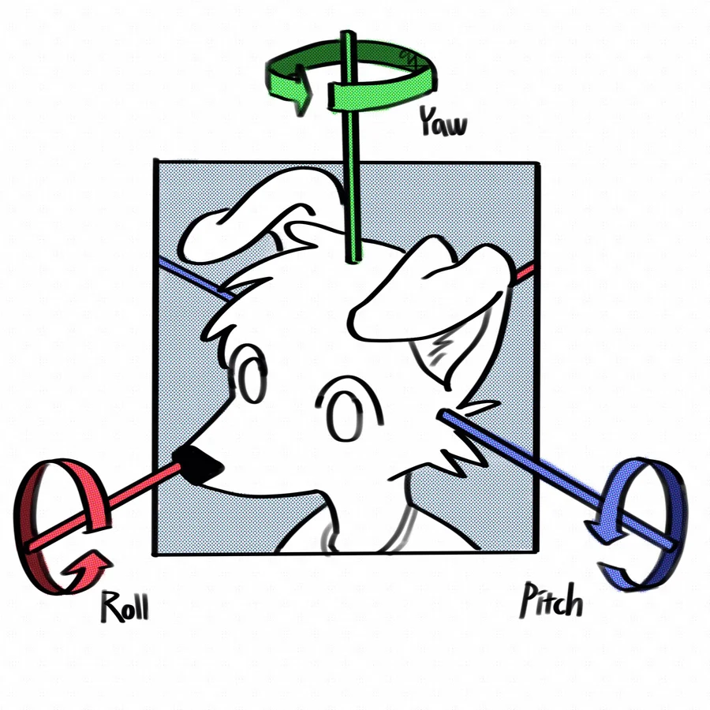

# 항공기 3축

항공기가 3차원 공간에서 방향전환을 위해 회전하는 3가지 축, 그리고 그 축을 중심으로 일어나는 운동. 라이트 형제가 고안하여 항공기에 적용했다.

- 롤(Roll): 항공기의 전후방 세로축을 중심으로 동체의 좌우가 상하로 움직이는 운동.
- 피치(Pitch): 항공기의 좌우 가로축을 중심으로 동체의 전후방이 상하로 움직이는 운동.
- 요(Yaw): 항공기의 수직축을 중심으로 동체가 좌우로 회전하는 운동.

_이해하기 쉬운 일러스트_
