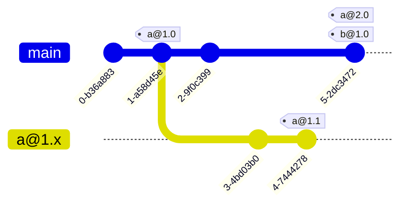
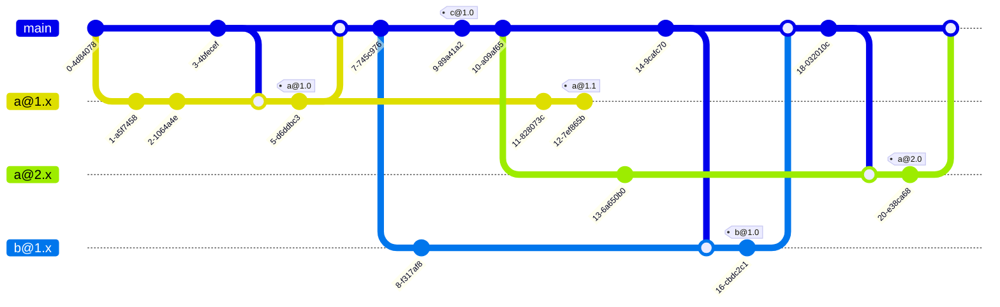
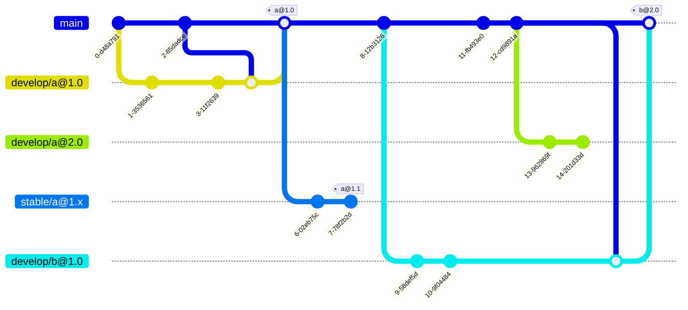
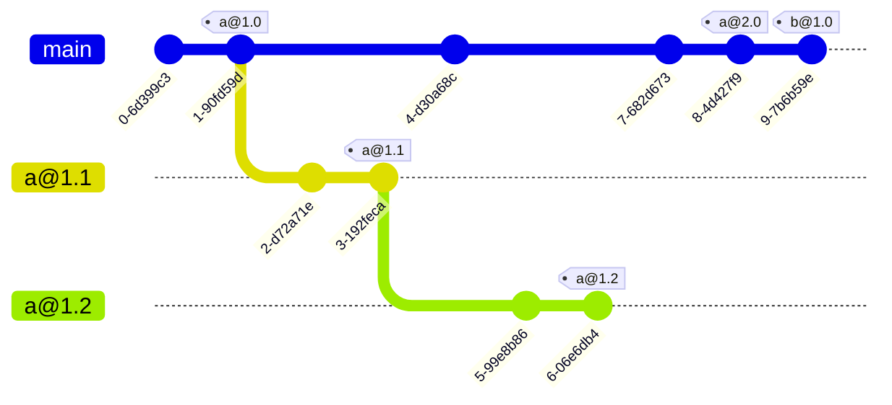
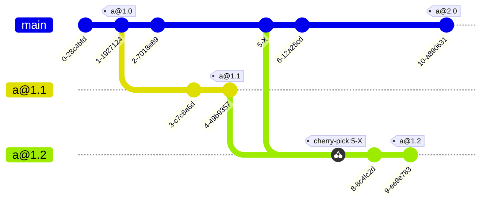
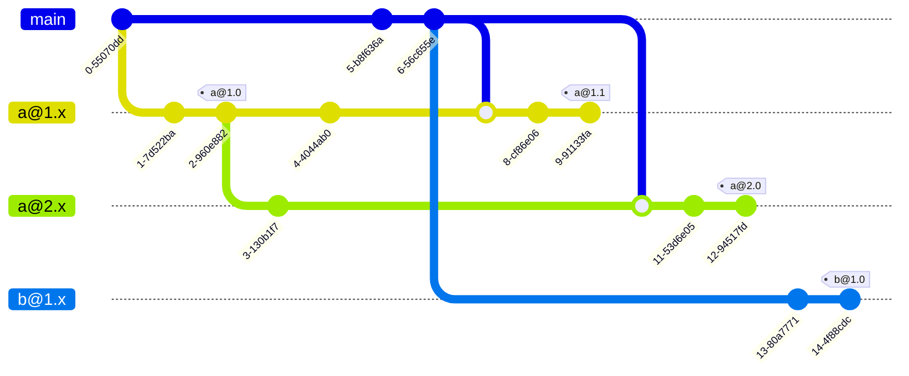

# 패키지 모노레포를 위한 브랜치 전략

패키지 레지스트리에 배포되는 다양한 패키지를 하나의 [[git]] 저장소에서 운영할 때 취할 수 있는 브랜치 전략을 연구한다. [[monorepo]]의 디렉토리 구조는 아래와 같다고 가정한다. `a`와 `b`는 서로 다른 주체가 운영하는 패키지이며, 모두 [[semver]]를 엄격히 준수한다.

```
.
+-- package.json
`-- packages/
   +-- a/
   |   +-- package.json
   |   `-- src/
   `-- b/
       +-- package.json
       `-- src/
```

[[monorepo]]를 위한 릴리스 도구 [Changesets](https://github.com/changesets/changesets)는 각 커밋에서 어떤 버전을 올리지 명시한 마크다운 파일을 작성해두면, main 브랜치에 새 커밋을 추가했을 때 실제 패키지의 버전을 올리는 릴리스 PR이 자동으로 발행한다. 릴리스 PR을 main 브랜치에 병합하면 실제로 레지스트리에 새 버전의 패키지가 릴리스된다. 즉, main 브랜치에 변경사항이 누적되면 하나의 릴리스 PR에서 여러 패키지가 릴리스될 수 있다.

또한 한 패키지가 저장소의 다른 패키지를 [[peer-dependencies]]으로 요구하기도 한다. 이때 버전을 [워크스페이스 프로토콜](https://yarnpkg.com/protocol/workspace)로 참조할 수 있다.

## 전략

### 전략 A


```mermaid
gitGraph
  commit
  commit tag:"a@1.0"
  branch "a@1.x"
  checkout main
  commit
  checkout "a@1.x"
  commit
  commit tag:"a@1.1"
  checkout main
  commit tag:"a@2.0" tag:"b@1.0"
```

main 브랜치에서 개발하고, 하위 메이저 버전의 마이너/패치 버전을 릴리스해야 하는 경우 버전 브랜치(e.g., `a@1.x`)를 만들어 관리하는 전략.

[Astro](https://github.com/withastro/astro)와 [TanStack Query](https://github.com/TanStack/query)를 비롯한 많은 오픈소스 프로젝트가 이와 같은 전략으로 릴리스한다. 버전 브랜치에는 체리픽만 허용하고 main 브랜치를 버전 브랜치로 병합하는 것은 허용하지 않는다.

대부분의 오픈소스 프로젝트에 이 전략이 잘 맞는 이유는 패키지의 운영주체가 하나이기 때문이다. main 브랜치에서 동시에 여러 패키지를 배포해도 문제가 없고, 릴리스 시점을 단일 주체가 결정할 수 있다. 패키지가 서로 연관되어 있을 가능성이 높으니 여러 패키지를 한 번에 릴리스하는 방식이 자연스럽다. 브랜치 관리 측면에서도 단순하다.

하지만 이 전략을 여러 주체가 운영하는 패키지 [[monorepo]]에 적용하면 관리를 어렵게 만드는 지점이 여러 곳에서 발견된다.

### 전략 A-1


```mermaid
gitGraph
    commit
    branch "a@1.x" order:1
    checkout "a@1.x"
    commit
    commit
    checkout main
    commit
    checkout "a@1.x"
    merge main
    commit tag:"a@1.0"
    checkout main
    merge "a@1.x"
    commit
    branch "b@1.x" order:3
    commit
    checkout main
    commit tag:"c@1.0"
    commit
    checkout "a@1.x"
    commit
    commit tag:"a@1.1"
    checkout main
    branch "a@2.x" order:2
    commit
    checkout main
    commit
    checkout "b@1.x"
    merge main
    commit tag:"b@1.0"
    checkout main
    merge "b@1.x"
    commit
    checkout "a@2.x"
    merge main
    commit tag:"a@2.0"
    checkout main
    merge "a@2.x"
```

main 브랜치를 기준으로 개발하되, 각 패키지의 릴리스 시점을 통제하기 위해 버전 브랜치를 운영하는 전략. `c@1.0`처럼 main 브랜치에서도 릴리스가 가능하다. main 브랜치에서는 언제든 패키지 릴리스가 일어날 수 있으므로 `a@1.x`와 같은 버전 브랜치를 만들어서 개발을 진행하고, `a@1.0` 릴리스가 준비되었을 때 main 브랜치로 병합하는 방식을 취한다.

패키지의 운영주체가 다양한 경우 이 전략에는 관리를 어렵게 만드는 지점이 여러 곳에 있다. 패키지의 버전 브랜치를 장기적으로 운영하면서 main 브랜치와의 변경사항을 계속 추적해야 하고, 새 메이저 버전을 릴리스할 때는 main 브랜치와의 충돌을 한꺼번에 해결해야 한다. 언제 main 브랜치에서 새 브랜치를 만들어야 하는지, 버전 브랜치를 언제 최신화하는지에 관한 세세한 규칙이 필요하기 때문에 정책이 복잡해질 수 있다.

### 전략 A-2


```mermaid
gitGraph
  commit
  branch "develop/a@1.0" order:1
  commit
  checkout main
  commit
  checkout "develop/a@1.0"
  commit
  merge main
  checkout main
  merge "develop/a@1.0" tag:"a@1.0"
  checkout main
  branch "stable/a@1.x" order:3
  commit
  commit tag:"a@1.1"
  checkout main
  commit
  branch "develop/b@1.0" order:4
  commit 
  commit
  checkout main
  commit
  commit
  branch "develop/a@2.0" order:2
  commit
  commit
  checkout "develop/b@1.0"
  merge main
  checkout main
  merge "develop/b@1.0" tag:"b@2.0"
```

브랜치 종류를 세분화해 main 브랜치, develop 브랜치, stable 브랜치를 분리하는 전략. develop 브랜치는 릴리스를 준비하는 브랜치다. develop 브랜치에서 릴리스 준비를 마치면 main 브랜치에 병합해 즉시 릴리스한다. stable 브랜치는 main 브랜치에서 이미 릴리스된 메이저 버전 범위를 관리하기 위한 브랜치로, 항상 main 브랜치의 특정 버전 태그로부터 분기해 만든다. 

패키지의 모든 변경사항은 develop 브랜치에서만 일어난다. 중요한 점은 main 브랜치에 develop 브랜치를 병합한 즉시 해당 버전을 릴리스해야 한다는 점이다. 그렇지 않으면 main 브랜치에 변경사항이 쌓여 의도치 않게 다른 패키지를 함께 릴리스하게 될 수 있다.

stable 브랜치에는 main 브랜치를 병합하지 않고, 반영이 필요한 커밋만 체리픽한다. 향후 이미 릴리스된 메이저 버전의 마이너/패치 버전을 릴리스해야 할 때는 stable 브랜치에서 작업하고 릴리스한다.

### 전략 B


```mermaid
gitGraph
    commit
    commit tag:"a@1.0"
    branch "a@1.1"
    commit
    commit tag:"a@1.1"
    checkout main
    commit
    checkout "a@1.1"
    branch "a@1.2"
    commit
    commit tag:"a@1.2"
    checkout main
    commit
    commit tag:"a@2.0"
    commit tag:"b@1.0"
```

main 브랜치를 불안정(unstable) 상태로 취급하는 전략. 이 전략에서 main 브랜치는 항상 개발 중인 상태이며, 아직 릴리스해서는 안 되는 변경사항이 포함되어 있음을 전제해야 한다. main 브랜치에서 모든 패키지를 릴리스하려 시도하면 의도치 않은 패키지가 함께 릴리스될 수 있기 때문에 이 전략을 사용하려면 main 브랜치에서 특정 패키지만 선택해서 릴리스하는 방법이 마련되어야 한다.

하위 메이저 버전의 마이너/패치 버전을 릴리스하려면, 필요한 시점에만 릴리스 태그에서 분기한 브랜치를 만들어 릴리스한다. 다른 전략과 달리, 버전 브랜치가 버전의 범위가 아닌 특정 버전을 의미한다. 즉, 버전 브랜치는 해당 버전의 스냅샷일 뿐이며, 해당 버전 릴리스 후에는 제거해도 형상 관리에 문제가 없어야 한다. 만약 버전 브랜치가 범위를 의미하게 되면 결과적으로 main 브랜치에 준하는 수준으로 운영해야 하는 브랜치가 늘어나기 때문에 이 전략의 장점인 단순성이 훼손되고 전략 A-1과 동일한 복잡성이 유발된다.

이 전략의 장점은 브랜치 관리가 단순하다는 점이다. 장기적으로 관리가 필요한 브랜치는 main 브랜치 뿐이다. 모든 최신 변경사항이 main 브랜치에 실시간으로 반영되므로 [[monorepo]]의 가시성이 높아진다는 점도 장점이다.

이 전략의 한계는 버전 브랜치를 main 브랜치의 최신 형상에 맞게 업데이트하고자 하는 경우 고통스럽다는 점이다.


```mermaid
gitGraph
    commit
    commit tag:"a@1.0"
    branch "a@1.1"
    checkout main
    commit
    checkout "a@1.1"
    commit
    commit tag:"a@1.1"
    checkout main
    commit id:"5-X"
    commit
    checkout "a@1.1"
    branch "a@1.2"
    cherry-pick id:"5-X"
    commit
    commit tag:"a@1.2"
    checkout main
    commit tag:"a@2.0"
```

위 예시에서 main 브랜치의 `5-X` 커밋에서는 저장소의 공통 도구를 수정했다. 이어서 `6-a25e7e2` 커밋에서 `a@2.0`에 포함할 작업을 했다. 그때 `a@1.1`에서 버그가 발견되었다. 버그를 수정하기 위해 `a@1.1`를 릴리스했던 `4-2d1af98` 커밋에서 `a@1.2` 브랜치를 만들었다. 앞서 main 브랜치에서 저장소 공통 도구를 수정했기 때문에 이 도구를 사용하려면 `a@1.2` 브랜치에 main 브랜치를 병합해야 한다. 하지만 main 브랜치에는 `a@2.0` 작업이 포함되어 있기 때문에 main 브랜치를 그대로 병합할 수는 없다. 따라서 `5-X` 커밋을 체리픽하고 `a@1.2` 작업을 진행한다. 체리픽 해야 하는 커밋이 하나라면 괜찮겠지만, main 브랜치에 커밋이 많이 쌓이면 최신화가 사실상 불가능할 수 있다.


[[react]] 저장소의 릴리스 방식이 이 전략과 유사하다. 모든 변경사항을 main 브랜치에서 만들고, 장기적인 유지보수 브랜치를 유지하지 않는다. 하위 메이저 버전의 새 마이너/패치 버전을 릴리스해야 하는 경우에는 하위 버전에서 임시 브랜치를 만들어 필요한 커밋만 체리픽한 뒤 배포한다. 이때 임시 브랜치에는 main 브랜치를 병합하지 않는다.

### 전략 C


```mermaid
gitGraph
    commit
    branch "a@1.x"
    checkout main
    checkout "a@1.x"
    commit
    commit tag:"a@1.0"
    branch "a@2.x"
    commit
    checkout "a@1.x"
    commit
    checkout main
    commit
    commit
    branch "b@1.x"
    checkout "a@1.x"
    merge main
    commit
    commit tag:"a@1.1"
    checkout "a@2.x"
    merge main
    commit
    commit tag:"a@2.0"
    checkout main
    checkout "b@1.x"
    commit
    commit tag:"b@1.0"
```

패키지별 브랜치를 완전히 분리하는 전략. 모든 패키지는 자신의 메이저 버전 범위를 표현하는 버전 브랜치에서만 릴리스된다. 이 전략에서 main 브랜치는 여러 패키지에서 사용되는 공통 코드나 설정 파일을 담고 있는 기반인 동시에, 새 패키지를 위한 템플릿이다. 각 패키지의 버전 브랜치는 main 브랜치를 병합함으로써 최신 기반으로 업데이트할 수 있다.

이 전략의 장점은 패키지의 관리 주체가 다른 패키지를 전혀 신경쓰지 않아도 된다는 점이다. 자신이 관리하는 브랜치에서 언제 패키지를 릴리스할지 통제할 수 있다. 또한 이 전략에서는 버전 브랜치가 다른 패키지의 형상을 담을 필요가 없다. 따라서 `a@*.x` 브랜치의 디렉토리 구조를 아래와 같이 간소화할 수 있다.

```
.
+-- package.json
`-- packages/
    +-- a/
        +-- package.json
        `-- src/
```

이 전략의 한계는 가시성이 떨어져 [[monorepo]]의 장점을 희석시킬 수 있다는 점이다. 다른 패키지를 워크스페이스 프로토콜로 참조하는 것은 불가능하다. 최소한 다른 브랜치를 체크아웃하지 않고도 각 패키지의 배포된 버전을 확인할 수 있는 대시보드나, 변경사항을 추적하기 위한 PR 리뷰 절차가 필요하다.

## 관련문서

- [[platform-engineering]]
- [[git]]
- [[monorepo]]

## 참고자료

- [Paul Hammant, 『Trunk Based Development』](https://trunkbaseddevelopment.com/)
