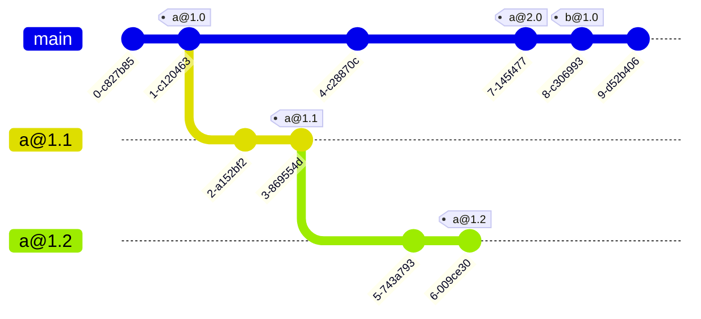

# 패키지 모노레포를 위한 브랜치 전략

패키지 레지스트리에 배포되는 다양한 패키지를 하나의 [[git]] 저장소에서 운영할 때 취할 수 있는 브랜치 전략을 연구한다. [[monorepo]]의 디렉토리 구조는 아래와 같다고 가정한다. `a`와 `b`는 서로 다른 주체가 운영하는 패키지다.

```
.
+-- pakcage.json
`-- pakcages/
   +-- a/
   |   +-- package.json
   |   `-- src/
   `-- b/
       +-- package.json
       `-- src/
```

## 피처 브랜치 방식


main 브랜치를 기준으로 개발하되, 필요한 경우 피처 브랜치 성격의 버전 브랜치(e.g., `a@1.x`)를 만드는 방식. 기본적으로는 `c@1.0`처럼 main 브랜치에서도 릴리스가 가능하다. main 브랜치는 모든 패키지의 최신 형상을 담고 있다. 이 방식에는 관리를 어렵게 만드는 지점이 여러 곳에 있다.

애초에 '최신 형상'에 대한 기준이 불분명하다. main 브랜치가 항상 최신 형상을 담아야 한다면, `a@1.0`도 main 브랜치에 병합하고, `a@2.0`도 main 브랜치에 병합해야 한다. 하지만 2.0 릴리스 후 `a@1.1`을 릴리스한다면 main 브랜치에 병합할 수 없다. 따라서 main 브랜치에 있는 형상은 항상 최신 메이저 버전의 첫 버전(`*.0`)만 보장할 수 있다.

또한 각 패키지의 릴리스 브랜치에 해당 패키지와 전혀 관련이 없는 패키지들의 형상이 포함된다. 가령 `a@*.x` 브랜치에도 `b` 패키지 형상이 포함된다. main 브랜치를 지속적으로 릴리스 브랜치에 병합하지 않으면 이 형상들은 낡은 것이 된다.

## 트렁크 기반 방식



main 브랜치만 사용하는 방식. 이 방식에서 하위 메이저 버전의 마이너/패치 버전을 릴리스하려면 필요한 시점에만 버전 브랜치를 만들고 릴리스한다. 다른 방식과 달리, 버전 브랜치가 버전의 범위가 아닌 특정 버전을 의미한다. 즉, 버전 브랜치는 해당 버전의 스냅샷일 뿐이며, 해당 버전 릴리스 후에는 제거되어도 형상 관리에는 문제가 없어야 한다. 버전 브랜치가 범위를 의미하게 되면 결과적으로 main 브랜치에 준하는 수준으로 운영해야 하는 브랜치가 늘어나기 때문에 트렁크 기반 방식의 단순성이 퇴색된다.

## 패키지 격리 방식


패키지를 완전히 분리하는 방식. 이 방식에서 main 브랜치는 각 패키지의 기반이 되는 공통 코드나 설정 파일을 담고 있는 '라이브러리의 라이브러리'인 동시에, 새 패키지를 위한 템플릿이다. 각 패키지의 버전 브랜치는 main 브랜치를 병합함으로써 최신 기반으로 업데이트할 수 있다.

이 방식의 단점은 가시성이 떨어져 [[monorepo]]의 장점을 희석시킬 수 있다는 점이다. 다른 패키지를 [워크스페이스 프로토콜](https://yarnpkg.com/protocol/workspace)로 참조하는 것은 불가능하다. 최소한 다른 브랜치를 체크아웃하지 않고도 각 패키지의 배포된 버전을 확인할 수 있는 대시보드나, PR 추적 리뷰 절차가 필요하다.

## 관련문서

- [[platform-engineering]]
- [[git]]
- [[monorepo]]

## 참고자료

- [Paul Hammant, 『Trunk Based Development』](https://trunkbaseddevelopment.com/)
