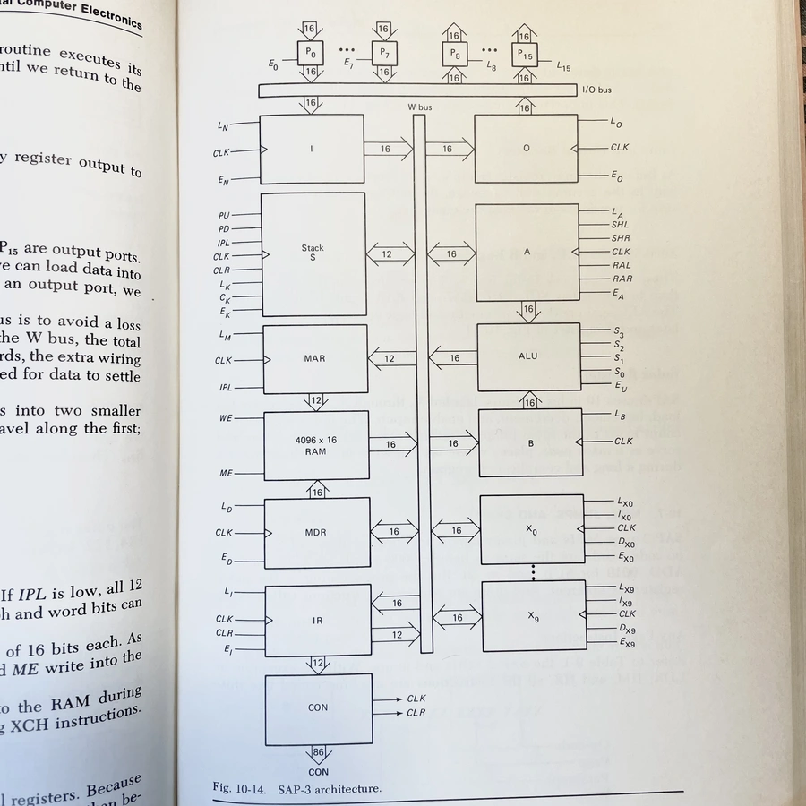

# Digital Computer Electronics

::: INFO
Albert P. Malvino, 『Digital Computer Electronics』, 1977.
:::

::: NOTE
트랜지스터와 다이오드로 논리 게이트를 만드는 것으로 시작해서 [[simple-as-possible-computer]]를 만드는 여정.

『밑바닥부터 만드는 컴퓨팅 시스템』이 사실 진짜 '밑바닥’이 아니라는 점에 갈증이 있었는데, 이 책으로 많은 부분을 해소했다.

이 책의 하이라이트는 SAP-3 아키텍처 다이어그램. 이 다이어그램 하나로 내가 컴퓨터에 대해 갖고 있던 의문들과 끼워넣지 못한 조각들을 모조리 해결했다. 학교 도서관 구석에서 찾은 보석같은 책.

:::

## 관련문서

- [[electronic-engineering]]
- [[simple-as-possible-computer]]
