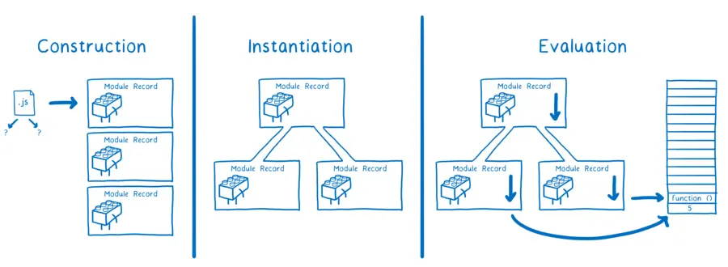

# ECMAScript 모듈

ECMAScript 모듈(ESM)은 [[javascript]]의 표준 모듈 시스템이다.

## 동작

ESM의 모듈 로드 과정은 세 단계로 나뉜다.



## vs CommonJS

### 비동기 로드

모듈을 비동기적으로 로드하기 때문에 성능상 이점이 있다.

### 트리 셰이킹

ESM 패키지는 의존 관계를 정적 분석을 할 수 있기 때문에 번들러가 불필요한 코드를 제거하는 트리 셰이킹(tree shaking)이 가능하다.

## ESM-only

자바스크립트 생태계가 이제는 ESM만을 지원해야 한다는 담론이다. 자바스크립트 생태계는 CJS와 ESM의 병용으로 인해 너무나 오래 고통받아왔다. 이제는 ESM으로 모듈 시스템을 통합함으로써 그 고통을 끝낼 수 있다.

이 담론은 CJS와 ESM을 함께 지원하는 듀얼 패키지(dual package) 역시 반대한다. CJS와 ESM은 근본적으로 다른 모듈 시스템이고, 설계 철학도 다르다. CJS는 단일한 `module.exports` 객체를 사용하는 반면, ESM은 `default`와 named export를 모두 지원한다. ESM 문법으로 코드를 작성한 뒤 CJS로 트랜스파일하면 내보내는 값이 함수나 클래스일 경우 이런 차이를 신경써야 한다. 또한 타입 정보를 올바르게 유지하려면 `.d.mts`와 같은 추가적인 선언 파일을 작성해야 한다. 하나의 패키지에 CJS와 ESM이 함께 있으면 종속성 탐색도 어려워진다. 만약 패키지가 또 다른 ESM-only 의존성을 갖는다면, 사용자가 CJS를 사용하는 경우 문제가 발생할 수 있기 때문이다. 뿐만 아니라, CJS와 ESM 번들을 함께 제공해야 하므로 패키지의 크기를 두 배로 늘린다. 

ESM-only를 어렵게 만든 가장 큰 원인은 Node.js가 CJS를 기본으로 채택했기 때문이고, 이로 인해 많은 자바스크립트 애플리케이션과 패키지가 CJS로 작성되었기 때문이다. 특히 ESM에서는 `import 'cjs'`와 같이 CJS 모듈을 불러올 수 있지만, CJS에서는 `require('esm')`이 불가능했다. 이를 활성화 하려면 `--experimental-require-module` 플래그를 설정해야 했는데, [Node.js 22.12](https://nodejs.org/en/blog/release/v22.12.0)부터 이 플래그가 기본으로 활성화되었다. 

## CJS to ESM

`require('esm')`이 지원됨에 따라, 큰 위험부담 없이 CJS 환경을 위한 ESM-only 패키지를 배포할 수 있게 되었다. 패키지를 ESM-only로 제작하고, CJS 사용처에서 `require('esm')`을 통해 사용하는 예시를 살펴보겠다.

### 패키지에서

#### package.json

패키지의 `package.json` 파일에서 `type` 필드의 값을 `module`로 설정한다.

```json
{
  "type": "module"
}
```

또한 `exports` 필드에 엔트리 파일의 상대 경로를 명시한다. `main` 필드로도 엔트리 포인트를 정의할 수 있지만, `exports` 필드를 사용하면 여러 엔트리 포인트를 정의할 수 있기 때문에 보다 현대적인 대안이라고 할 수 있다.

```json
{
  "type": "module",
  "exports": "./dist/index.js"
}
```

#### tsconfig.json

`tsconfig.json` 파일에서 `module` 필드의 값을 `nodenext`로 설정한다. `module` 필드는 트랜스파일된 결과물에 어떤 모듈 시스템을 사용할지를 정의한다.

```json
{
  "compilerOptions": {
    "module": "nodenext"
  }
}
```

`module` 필드의 값을 `nodenext`로 설정하면 ESM 패키지인 경우(가장 가까운 `package.json` 파일의 `type`이 `module`이거나 파일 확장자가 `.mts`인 경우) ESM으로, CJS 패키지인 경우 CJS로 트랜스파일된다. [[typescript]] v5.8부터는 `module` 값을 `nodenext`로 설정하면 `require('esm')`이 지원된다.

`moduleResolution` 필드의 값도 `nodenext`로 설정한다. `moduleResolution` 필드는 `import` 구문에서 참조하는 모듈의 경로를 어떻게 해석할지 정의한다.

```json
{
  "compilerOptions": {
    "module": "nodenext",
    "moduleResolution": "nodenext"
  }
}
```

`moduleResolution` 필드의 값을 `nodenext`로 설정하면 모듈 해석에 Node.js v12 이상의 모듈 해석 방식을 사용한다. ESM 패키지인 경우 `import` 알고리즘으로 해석하고, CJS 패키지인 경우 `require` 알고리즘으로 해석한다. 단, `require` 구문에 대해서는 항상 `require` 알고리즘으로, `import` 구문에 대해서는 항상 `import` 알고리즘으로 해석한다.

#### 코드

코드에서도 CJS 문법이 아닌 ESM 문법을 사용한다. 가령 `require` 대신 `import`를 사용한다. 이때 파일의 경로에는 확장자를 붙여야 한다.

```javascript
import { foo } from './foo.js'
```

타입스크립트를 사용하는 경우에도 트랜스파일된 코드를 기준으로 `./foo.ts`가 아닌 `./foo.js`를 참조해야 한다.

`export` 구문도 ESM 문법을 사용한다.

```javascript
export function foo() {
  return 'foo'
}
```

### 사용처에서

사용처에서 `require('esm')`을 사용하기 위한 요구사항은 아래와 같다.

- Node.js v22.12 이상.
  ::: INFO
  [Ruy Adorno, "Node v22.12.0 (LTS)", 2024](https://nodejs.org/en/blog/release/v22.12.0)
  :::
- [[yarn]]을 사용하는 경우, v4.6.0 이상.
  ::: INFO
  [@yarnpkg/cli/4.6.0](https://github.com/yarnpkg/berry/releases/tag/%40yarnpkg%2Fcli%2F4.6.0)
  :::
- [[typescript]]를 사용하는 경우, v5.8 이상.
  ::: INFO
  [Daniel Rosenwasser, "Announcing TypeScript 5.8", 2025](https://devblogs.microsoft.com/typescript/announcing-typescript-5-8)
  :::

`require('esm')`이 가능하지만, 만약 로드하는 ESM 패키지에 top-level await가 포함되어 있다면 `ERR_REQUIRE_ASYNC_MODULE` 에러가 발생할 수 있다.

## 참고자료

- ["JavaScript modules", MDN Web Docs](https://developer.mozilla.org/ko/docs/Web/JavaScript/Guide/Modules)
- [Anthony Fu, "Move on to ESM-only", 2025](https://antfu.me/posts/move-on-to-esm-only)
- [Sindre Sorhus, "Pure ESM package", 2025](https://gist.github.com/sindresorhus/a39789f98801d908bbc7ff3ecc99d99c)
- [Lin Clark, "ES modules: A cartoon deep-dive", 2018](https://hacks.mozilla.org/2018/03/es-modules-a-cartoon-deep-dive/)

## 관련문서

- [[typescript]]
