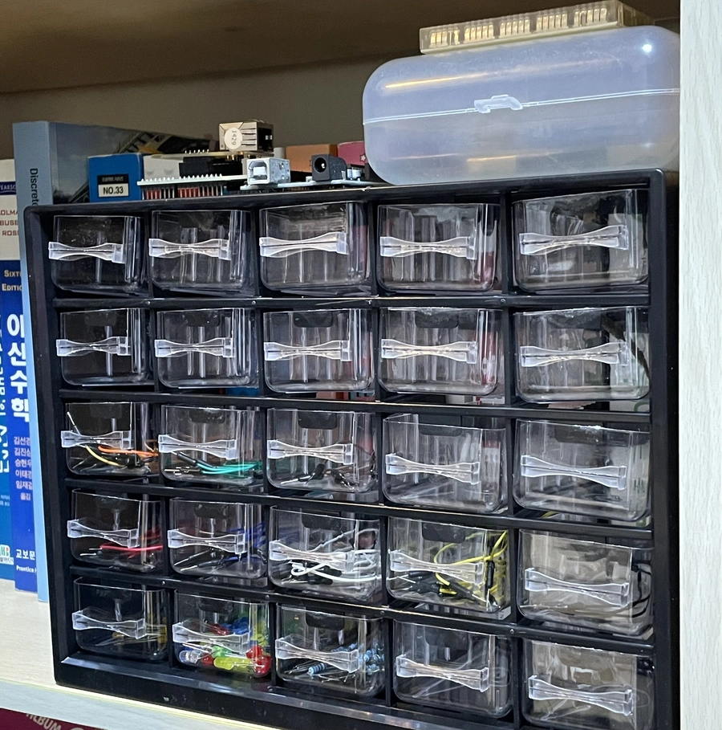
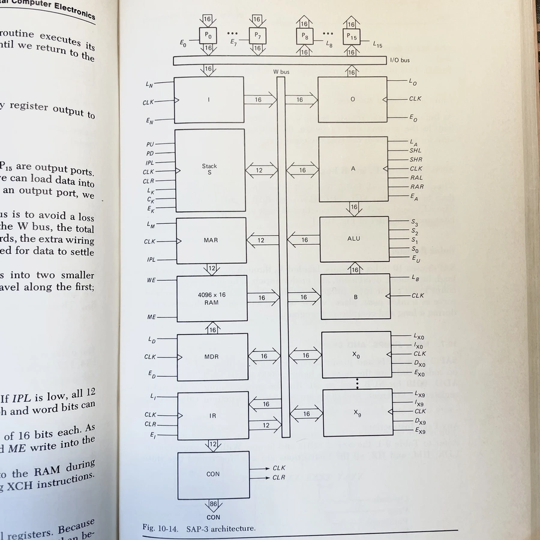
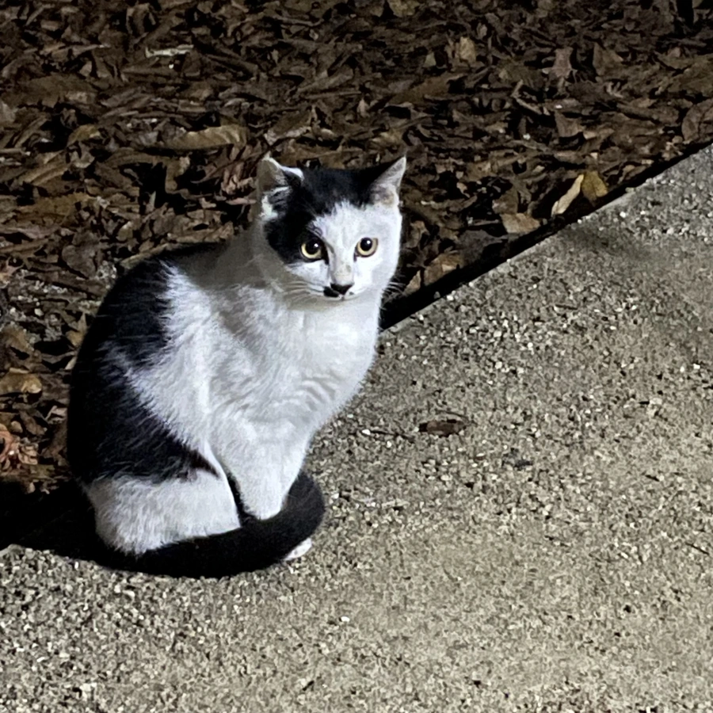
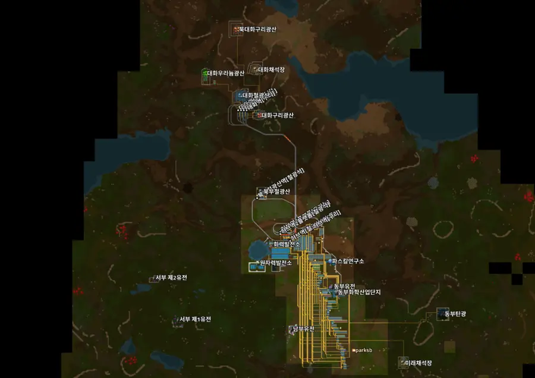
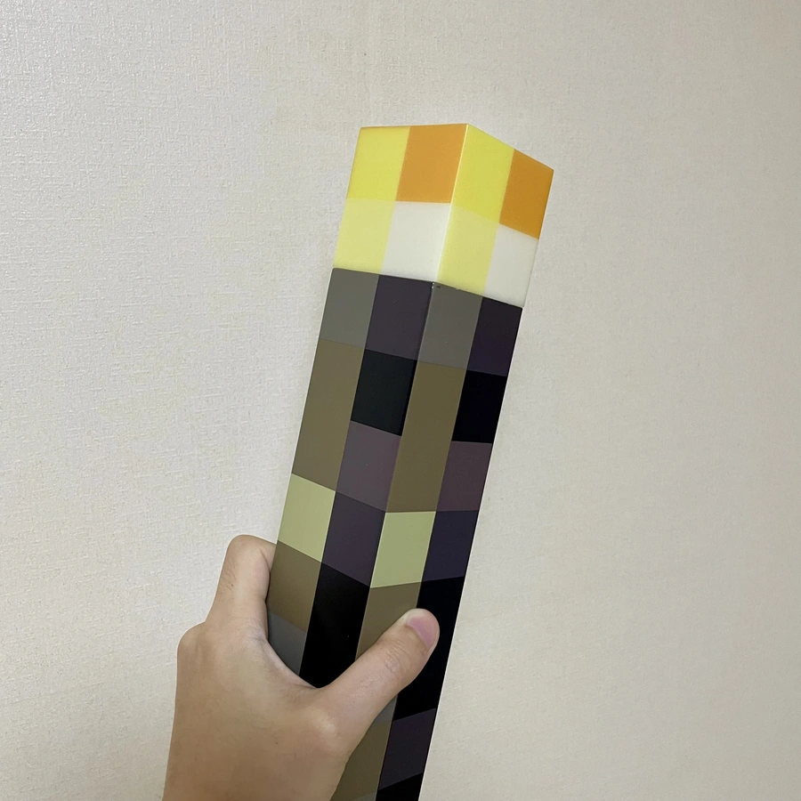

# Goodbye 2024

## 1월

- 운동을 좀 재밌게 해보려고 Wii를 당근했다. 타이틀 8개까지 포함해서 10만원.
- 친구들과 함께 PS 스터디를 시작했다.
- 퀀트 투자 공부를 해서 좋은 펀더멘털의 소형주를 찾아주는 노트북을 작성했다:
  - 모든 상장 종목에 대해 PSR, PGPR, POR, PER 등 8개 팩터로 정규화된 점수를 낸다. 이후 6개월 실적은 괜찮았다.
  - 근데 20개 넘는 개별주를 매매하는게 힘들어서 [FNDA](https://www.schwabassetmanagement.com/products/fnda)로 갈음했다. 나중에는 아버지를 위해 돌리게 됐다.
- 올해도 스키를 탔다.
- 그렇게 찾아 헤매던 먹태깡을 먹었다.
- 영화를 정말 많이 봤다. 특히 구로사와 아키라 감독 영화를 많이 봤다.
- :writing_hand: [스마트폰을 PC의 모션 컨트롤러로 만들기](https://parksb.github.io/article/42.html)
- :headphones: 이승재, "아득히 먼곳", 1993
- :clapper: **"라쇼몽", 1950**
- :clapper: "동경 이야기", 1953
- :clapper: "이키루", 1952
- :clapper: **"7인의 사무라이", 1954**
- :clapper: "시민 케인", 1941
- :clapper: "탑", 2022
- :clapper: "돼지가 우물에 빠진 날", 1996
- :clapper: "옥희의 영화", 2010
  - 내가 왜 이런 영화에 끌리는지 알겠다. 깔대기로 모아놓은 것 같은 걸 안 좋아해서.
- :clapper: "애스터로이드 시티", 2023
- :clapper: "거미집", 2023
- :clapper: "TAR", 2022
- :clapper: "스파이의 아내", 2020
- :clapper: "햐얀 전쟁", 1992
- :clapper: "장르만 로맨스", 2021
  - 뭔가 이병헌 감독 스타일.
- :clapper: "백조", 2023
- :clapper: "기상천외한 헨리 슈거 이야기", 2023
- :clapper: "쥐잡이 사내", 2023
- :clapper: "독", 2023
- :clapper: "서부 전선 이상 없다", 2022
- :clapper: "모리타니안", 2021
- :clapper: "밀수", 2023
- :clapper: "리브 더 월드 비하인드", 2023
- :clapper: "버드 박스: 바르셀로나", 2023
- :clapper: "외계+인 2부", 2024
- :clapper: "천박사 퇴마 연구소: 설경의 비밀", 2023
- :book: 최석원, "나의 첫 채권투자 교과서", 2023
- :book: 강환국, "퀀트 투자 무작정 따라하기", 2022
- :book: 헤라르트 윙어르, "당신이 읽는 동안", 2023
- :book: 데미안 콘라드, "요제프 뮐러 브로크만이 대체 누구야?", 2022
  - 오랜 경력을 가진 디자이너들의 라떼 이야기. 유럽 그래픽 디자인의 과거와 현재를 관통하는 통찰을 엿볼 수 있다.
  - 스위스 스타일로 표방되는 국제주의 양식에 대한 다양한 관점과 역사를 살펴보는 즐거운 경험이었다.
- :book: 알렉스 쉬, "가상 면접 사례로 배우는 대규모 시스템 설계 기초 2", 2024
  - '내가 뭘 모르는지' 알기 위한 최고의 시리즈.

## 2월

- 채권 투자를 시작했다. A등급 회사채만 골라서 수익률이 대단히 높지는 않지만, 예금보다는 낫다.
- 거제도로 가족 캠핑을 갔다. 혼자 작은 텐트에 누워서 따뜻한 침낭 안에서 잤는데 파도소리와 풀벌레 소리가 좋았다.
- 여자친구와 안면도로 여행을 다녀왔다. 정말 고립된 곳으로 가고 싶었는데, 완벽했다.
- 홈브루 컴퓨터를 만들어보고자 알리에서 부품을 이것저것 샀다:
  
- :headphones: (G)I-DLE, "Wife", _2_, 2024
- :headphones: 비비, "밤양갱", _밤양갱_, 2024
- :performing_arts: **"살아있는 자를 수선하기" @국립정동극장**
- :clapper: "웡카", 2023
- :clapper: "레고 무비", 2014
- :clapper: "슈퍼 마리오 브라더스", 2023
- :book: **Albert P. Malvino, "Digital Computer Electronics", 1977**
  - 트랜지스터와 다이오드로 논리 게이트를 만드는 것으로 시작해서 [[simple-as-possible-computer]]를 만드는 여정.
  - <밑바닥부터 만드는 컴퓨팅 시스템>이 사실 진짜 '밑바닥'이 아니라는 점에 갈증이 있었는데, 이 책으로 많은 부분을 해소했다.
  - 이 책의 하이라이트. 이 다이어그램 하나로 내가 컴퓨터에 대해 갖고 있던 의문들과 끼워넣지 못한 조각들을 모조리 해결한 것 같다. 도서관 구석에서 찾은 보석같은 책.
    
- :book: 마크 리처즈 외, "소프트웨어 아키텍처 101", 2021
- :book: 김종관, "Do it! 알고리즘 코딩 테스트: 파이썬 편", 2022
- :book: 석동민, "채권투자 처음공부", 2023
- :book: 헤럴드 에이블슨 외, "자바스크립트로 배우는 SICP", 2022
  - 컴퓨터를 통해 정보를 추상화하는 방법에 대한 탑다운 접근. 이 과정에서 컴퓨터공학의 고전적 문제와 도전들을 광범위하게 찍먹한다.
  - 이미 프로그래밍에 익숙하다면 내용이 너무 장황하게 느껴질 수 있는데, 진지하게 컴퓨터공학을 공부하고자 하는 사람에게는 여전히 추천하고 싶다.

## 3월

- XR 수업을 수강신청해서 들었다.
  - 유니티를 처음으로 제대로 써봤다. 성능이 좋지 않은 윈도우즈 노트북에서는 개발이 너무 힘들었다.
  - 그래도 AR 프로젝트는 연구실 우분투 컴퓨터로 원활하게 할 수 있었는데, VR 프로젝트가 문제였다. 메타 퀘스트가 윈도우즈만 지원한다.
  - 학교에서 메타 퀘스트 2를 빌려준 건 정말 좋았다.
- :clapper: **"듄: 파트2", 2024**
  - 난 파트 1보다 좋았다.
- :clapper: "파묘", 2024
- :clapper: "문라이즈 킹덤", 2012

## 4월

- 총선 투표를 했다. 내 지역구에서는 새벽까지 박빙이 이어져서 잠을 못 잤다.
- :headphones: **아일릿, "Magnetic", _SUPER REAL ME_, 2024**
- :headphones: 르세라핌, "Smart", _EASY_, 2024
- :headphones: 르세라핌, "EASY", _EASY_, 2024
- :clapper: "노량: 죽음의 바다", 2023
- :book: 모리미 토미히코, "다다미 넉 장 반 세계일주", 2008
  - 원작 소설보다 영상이 인상적이기 쉽지 않은데, 유아사 마사아키의 표현력이 얼마나 천재적인지 알 수 있었다.
- :book: 박일문, "살아남은 자의 슬픔", 1992
- :book: 마틴 데이비스, "오늘날 우리는 컴퓨터라 부른다", 2023
  - 약 300년을 시간 여행해서 컴퓨터라는 기계의 근원을 찾는 책. 재미있었다.

## 5월

- 마지막 학생예비군 훈련에 참여했다.
- 매주 주말 백준에서 열리는 대학 프로그래밍 대회에 참여했다: 숭실대, KAIST, 국민대, 숙명여대, 인하대, 서강대, 아주대, GIST, 서울대
- H기업에 지원했다.
- :headphones: **한로로, "입춘", _입춘_, 2022**
- :headphones: 백현진, "빛", _가볍고 수많은_, 2019
- :headphones: NMIXX, "Roller Coaster", _A Midsummer NMIXX's Dream_, 2023
- :clapper: "펄프 픽션", 1994
- :book: 애슐리 데이비스, "도커, 쿠버네티스, 테라폼으로 구현하는 마이크로서비스", 2022
- :book: 엘튼 스톤맨, "도커 교과서", 2022
- :book: 이가라시 타카유키 외, "그림으로 이해하는 가상화와 컨테이너", 2022
- :book: 오가사와라 시게타카, "그림으로 이해하는 AWS 구조와 기술", 2021
- :book: 허준, "쿠버네티스 개발 전략", 2022
  - 쿠버네티스가 대부분의 경우 오버엔지니어링이라는 의견도 있지만, 현재로서는 대규모 분산 시스템에서 온갖 수작업과 불안감으로 점철된 배포 절차를 자동화하기 위해 선택할 수 있는 최적의 도구라는 생각이 든다.
  - 단순히 스펙과 사용법을 나열하지 않고, 문제 상황을 상정하고 전통적인 해결 방식과 쿠버네티스의 방식을 제시하는 점이 좋았다.

## 6월

- **여자친구와 2주년을 맞이했다.**
- M기업, K기업에 지원했다.
- :clapper: "초록물고기", 1997
- :clapper: "너와 나", 2023
- :clapper: "신극장판 이니셜 D 레전드 3 -몽현-", 2016
- :clapper: "신극장판 이니셜 D 레전드 2 -투주-", 2015
- :clapper: "신극장판 이니셜 D 레전드 1 -각성-", 2014
- :book: 마이클 하우센블라스, "모던 리눅스 교과서", 2023
- :book: 네하 나크헤데 외, "카프카 핵심 가이드", 2018
- :book: Kenneth H. Rosen, "Discrete Mathematics and Its Applications 8th Edition", 2018
- :book: 오승한, "과학기술과 법", 2020
- :book: 김가림, "개발자를 위한 레디스", 2023

## 7월

- 여자친구와 동해 여행을 다녀왔다. 강릉, 속초, 양양말고 다른 곳을 찾다가 동해로 갔는데, 대만족이었다.
- M기업 코딩테스트를 했다:
  - 정식으로 코테를 준비하고 한 건 처음인데, 생각보다 어려웠다.
  - 나름 다 풀긴 했는데, 결과가 나오는 플랫폼이 아니라서 아마 히든 케이스와 퍼포먼스에 문제가 있었을 것이다.
- P기업, F기업, C기업에 지원했다.
- <클린 코드>를 읽다가 "플계층"이 뭘까...했는데 '레이어'를 '계층'으로 일괄 치환하면서 '플레이어'까지 '플계층'으로 바뀐 것이다. "바람이 프랑스어오고 있었다"같은 실수를 직접 보게 되다니:
  
- [꼬맨틀](https://semantle-ko.newsjel.ly/)을 열심히했다.
- [Holotypic Occlupanid Research Group](https://www.horg.com/horg/)을 구경했다.
  - 빵 클립을 분류학적으로 연구하는 그룹...(?) 엑스레이까지 찍는 광기를 보고 할 말을 잃었다.
- 이제 구직을 위한 공부가 필요할 것 같아서 학교 도서관에서 책을 잔뜩 빌려 며칠 내내 읽었다.
- :headphones: **정태춘, 박은옥, "92년 장마, 종로에서", _92년 장마, 종로에서_, 1993**
  - 아주 가까운 장면들로 시작해서 점차 멀리서 조망하는 장면으로, 서울 전경으로, 시대적 풍경으로 확장된다.
- :headphones: Vaundy, "odoriko", _odoriko_, 2021
- :book: 로렌티우 스필카, "스프링 교과서", 2024
- :book: 마르친 모스카와, "코틀린 코루틴", 2023
- :book: 조세영, "코틀린 코루틴의 정석", 2024
- :book: 로버트 C. 마틴, "클린 아키텍처", 2019
- :book: 백은빈 외, "Real MySQL 8.0 1권", 2021
- :book: 백은빈 외, "Real MySQL 8.0 2권", 2021
- :book: 최범균, "도메인 주도 개발 시작하기", 2022
- :book: 대니얼 니히터, "MySQL을 더 빠르게, 성능 최적화 선택과 집중", 2023
- :book: 저우즈밍, "JVM 밑바닥까지 파헤치기", 2024
  - 자바에 대한 자료는 정말 많지만, JVM에 대한 깊이있는 자료는 구하기 어렵다. 그래서 더 귀한 책.
  - 보통 "JVM에서의 동작은 어떻다"(e.g., "GC는 세대 구분을 한다")라고 많이 설명하는데, JVM 명세에 정의되어 있지 않은 동작도 많다는 걸 알 수 있었다.
- :book: 마르친 모스칼라, "이펙티브 코틀린", 2022

## 8월

- **졸업했다:**
  
  - 2017년 3월에 입학했으니 7년 5개월만에 졸업한 것이다.
  - 수석 입학하고 우수 졸업 못하면 좀 부끄러울 것 같아서 1학년 때부터 좀 걱정했는데... 다행히 우수 졸업을 했다.
- **라즈베리파이4B 8GB를 반려서버로 맞이했다**:
  - 당근하고 돌아오는 길에 엄청난 구름을 만났다. 여름이었다:
    
  - 원래 넷북에 홈서버를 구동해왔는데, 성능 문제와 i386 호환성 문제를 계속 겪어왔다.
  - 대안으로 라즈베리파이5와 N100 미니PC도 비교했는데, 가성비와 낭만을 고려해 결정했다.
  - 결과는 대만족. 각종 셀프호스팅 서비스를 올렸고, Netdata로 모니터링하고 있다.
  - 가벼운 리버스 프록시를 찾다가 [pingora](https://github.com/cloudflare/pingora)를 이용해 직접 만들었다.
  - 인텔리제이 백엔드를 돌리고 싶었는데 무리였다. 되긴되는데 느리다.
  - CPU 온도가 좀 높아서 알리에서 액티브 쿨러를 샀다. 효과가 확실했다:
    
- F기업 인터뷰를 했다:
  - 2018년 이후 첫 면접이었다.
  - 설계 면접은 처음이라 좀 당황했다. 전형 과정은 정말 매끄러웠다.
- O기업, D기업, L기업에 지원했다.
- O기업 코딩테스트를 했다:
  - 문제가 많아서 당황했지만, 쉬워서 마지막 문제를 제외하고 모두 풀었다.
  - 마지막 문제는 시간이 부족해서 시간초과를 고치지 못하고 제출했다.
- 대학생활 내내 쌓아온 [campus-life](https://github.com/parksb/campus-life) 저장소를 아카이브했다.
- [Collie](https://github.com/collie-reader/collie)의 self-hosted 동기화 서버를 만들기 위해 [collied](https://github.com/collie-reader/)를 만들기 시작했다.
- :headphones: 프로미스나인, "Supersonic", _Supersonic_, 2024
- :clapper: **"란", 1985**
  - 이걸 보기 위해 학교 도서관까지 가서 불편한 의자에 3시간을 앉아있었다. 그럴 가치가 있었다. 최고였다.
- :clapper: "파워 오브 도그", 2021
- :clapper: "인사이드 아웃 2", 2024
- :clapper: "더 킹: 헨리 5세", 2019
- :book: 마크 헤클러, "처음부터 제대로 배우는 스프링 부트", 2023
- :book: 장정우, "스프링 부트 핵심 가이드", 2022
- :book: 샘 뉴먼, "마이크로서비스 아키텍처 구축", 2023

## 9월

- 친구들과 양평으로 여행을 다녀왔다. 기대한 레저 파크는 실망스러웠고, 볼링이 메인 콘텐츠였다.
- 종강 이후로 구직 기간이 길어지니 조금 불안해졌다. 제3의 선택지도 살짝 고민해봤다.
- O기업 라이브 코딩테스트를 했다:
  - 기술인터뷰가 라이브 코딩테스트인줄 몰랐는데, 인터뷰 며칠 전 갑자기 코테를 한다고 알려왔다.
  - 화상으로 설명하면서 알고리즘 문제를 푸는 건 정말 어려웠다. 인터뷰는 준비된 퀴즈 질문을 던지는 식이라 별로였다.
  - 사실 전형 진행 과정 전체가 O기업에 대한 이미지가 안 좋아질 정도로 매끄럽지 못했다.
- D기업 1차, 2차 인터뷰를 했다. 2차 인터뷰에 예고되지 않은 설계 면접이 포함되어 있어 조금 당황했다.
- T기업에 지원했다.
- :headphones: 브로콜리너마저, "졸업", _졸업_, 2010
- :clapper: **"장고: 분노의 추적자", 2012**
  - 여행가서 큰 기대없이 봤는데, 타란티노답게 시원했다.
- :clapper: "반딧불이의 묘", 1988
- :clapper: "비트", 1997
- :clapper: "범죄도시3", 2023
- :video_game: "문명 6", 2016
  - 줄곧 문명5만 해오다가, 문명7 트레일러를 보니 살 일이 없을 것 같아서 큰 고민없이 샀다.
  - O기업 인터뷰 끝나자마자 밤새서 했다.
- :book: 이브 포셀로 외, "웹 앱 개발을 위한 GraphQL", 2019
- :book: 게일 라크만 맥도웰, "코딩 인터뷰 완전 분석", 2017
- :book: John Ousterhout, [[a-philosophy-of-software-design]], 2018
  - 작은 모듈이 아니라 깊은 모듈을 지향하라는 조언이 핵심. 자바 생태계 특유의 번잡스러운 인터페이스 설계를 지적해서 속이 다 시원했다.
  - 12장부터는 이렇게 많은 페이지를 할애했어야 했나싶기도. 클린코드와 배치되는 주장들은 흥미롭고 공감됐다.
- :book: Andrea C. Arpaci-dusseau et al., "운영체제: 아주 쉬운 세 가지 이야기", 2016
  - 두 번째 운영체제 교과서로 제격. 공룡책에 비해 실전적인 내용이 많아서 재미있게 읽을 수 있는 전공서.
  - 모든 레퍼런스에 코멘트가 달려있어서 더 좋다. 심지어 무료다.
- :book: 댄 밴더캄, "이펙티브 타입스크립트", 2021

## 10월

- T기업 1차, 2차 인터뷰를 했다:
  - 지난 D기업 인터뷰의 패착이 너무 긴장한 상태로 경직된 답변을 한 것에 있다고 판단하고, 이번에는 완전히 대화하듯 임했다.
  - 페퍼민트와 초콜릿으로 정신을 각성시켜놔서 밤에도 잠을 못 잤다.
  - 2차 인터뷰를 마친 뒤로 그냥 계획없이 놀았다.
- 모교 중학생들을 대상으로 진로 강연을 했다:
  - 이 강연자료를 준비하는게 T기업 2차 인터뷰 준비에 도움이 됐다.
  - 생각보다 많은 학생들이 [하루](https://www.harooo.com/)를 알고 있어서 놀랐다. 이제 10년 전인데... 당신들 4살 때 만든건데...
- 블로그 코드 하이라이터를 shikijs로 바꾸고, MIPS 어셈블리 지원을 추가했다: [shikijs/textmate-grammars-themes#95](https://github.com/shikijs/textmate-grammars-themes/pull/95)
- :headphones: QWER, "고민중독", _MANITO_, 2024
  - 원래 별로 안 좋아했는데 박정민 배우가 부르는걸 보고 좋아졌다.
- :clapper: **"존 오브 인터레스트", 2023**
  - 서술하지 않음으로써 서술되는 벽 뒤의 풍경들. 천재적이었다.
- :clapper: "추락의 해부", 2023
- :clapper: **"그대들은 어떻게 살 것인가", 2023**
  - 일본 근현대사에 대한 알레고리. 미야자키 하야오가 쌓아온 세계관의 집대성이었다.
- :clapper: "전, 란", 2024
- :clapper: "탈출: 프로젝트 사일런스", 2023
  - 차마 끝까지 못 봤다.
- :book: 정경화, "유난한 도전", 2022
- :book: 리드 헤이스팅스 외, "규칙 없음", 2020
- :book: 세스 스티븐스 다비도위츠, "데이터는 어떻게 인생의 무기가 되는가", 2022

## 11월

- **T기업에서 오퍼레터를 받았다.**
- 설악산으로 캠핑을 갔다. 사진은 모닥불 옆 고양이:
  
- Page Speed Insights에서 블로그의 CLS가 엄청 떨어진 것을 발견했다:
  - 확인해보니 markdown-it-image-lazy-loading 플러그인이 이미지 태그에 `width`와 `height` 속성을 추가하지 않고 있었다. 첫 번째 원인은 플러그인 적용 순서로 인한 것이었고, 두 번째 원인은 플러그인이 비디오 태그에 속성을 추가하는 과정에서 조용한 에러가 일어나고 있었다.
  - 사용 중인 플러그인을 포크해서 직접 해결했다: [parksb/markdown-it-image-lazy-loading](https://github.com/parksb/markdown-it-image-lazy-loading)
- 생일에 여자친구와 파주에서 1박을 했다.
- :clapper: "퍼펙트 블루", 1998
- :clapper: "탈주", 2024
- :clapper: "킬 빌 1", 2003
- :clapper: "킬 빌 2", 2004
- :clapper: "바스터즈: 거친 녀석들", 2009
- :video_game: "Factorio"
  - 오랜만에 팩토리오를 열심히 했다.
  - [[goodbye-2019]]{2019년}에 친구들과 했던 멀티플레이 서버와 비교하면 규모는 작지만, 설계는 좀 더 만족스럽다.
    
- :video_game: "Project Zomboid"
  - T기업 레퍼런스 체크를 기다리며 친구들과 함께 샀다.
  - 매주 주말 저녁 8시에 모여 플레이했다.
- :book: 서현, "도시논객", 2024
  - "인문학으로 출발해 공학으로 실현되어 예술로 남기를 바라는 것이 건축", 그래서 이 책은 건축학 책이 아니라 인문학 책이다.
  - [[what-did-architecture-do]]와 맞닿는 지점이 있다.
- :book: 숀케 아렌스, [[how-to-take-smart-notes]], 2023
  - 위키를 다시 정비한 뒤 이 책을 읽고 메모를 열심히 썼다.
- :book: 오마가리 토시, "아케이드 게임 타이포그래피", 2024
  - 제한된 8x8 격자에 글꼴을 표현하기 위한 온갖 기법과 관습, 위트, 트릭이 깜찍하다.
- :book: 장강명, "한국이 싫어서", 2015
  - "너 몇 살?"부터 "신분 상승"까지, 한국이 싫어서 떠난 계나에게서 너무나 강렬한 한국의 모습이 겹쳐보일 때마다 웃펐다.

## 12월

- **첫 출근을 했다.**
- **국회의사당에 나갔다.**
  - 내란사태 이후로 2주 내내 뉴스를 놓지 못했다. 그 당일의 충격은 이루 말할 것도 없다. 잠도 거의 못잤다.
  - 정작 탄핵소추안 가결 당일에는 감기몸살 때문에 가지 못했다. 횃불까지 샀는데...
    
- 디지털 가든을 htmx와 함께 리뉴얼했다: https://github.com/parksb/pedia
- 12월에 너무 많은 일이 있었다. 숙연하게 2025년을 맞이했다.
- :framed_picture: "불멸의 화가 반 고흐" @한가람미술관
- :headphones: 노래를 찾는 사람들, "광야에서", _노래를 찾는 사람들 II_, 1990
- :headphones: 소녀시대, "다시 만난 세계", _다시 만난 세계_, 2007
- :clapper: "한국이 싫어서", 2024
- :clapper: **"프라블러미스타", 2023**
  - 정말 인상적이었다. 지금까지 A24 영화를 선택했을 때 실패한 적이 없다.
- :book: 게르겔리 오로스, [[the-software-engineers-guidebook]], 이민석 역, _한빛미디어_, 2024
  - 대단히 임팩트있는 통찰을 제공하지는 않지만, 사실상 무계획의 커리어 패스를 걷고 있는 나에게는 작은 이정표가 됐다.
  - "OO해라", "OO하지마라"가 반복되는 책은 거부감이 드는데, 다양한 커리어 패스와 대안을 제시하는 방식으로 구성되어 있어서 좋았다.
  - 앞 부분에 몇몇 유명한 엔지니어들의 링크드인 프로필을 인용하며 커리어 패스의 유형을 소개하는 부분이 있는데, 뒤에서도 비슷하게 구체적인 사례를 더 보여줬으면 좋았을 것 같다. 아마 나중에 한번 더 꺼내서 읽어볼 듯하다.
- :book: Carson Gross et al., [[hypermedia-systems]], 2023.
  - 꽤나 인상적인 부분이 있었고, 그들의 문제의식에도 공감이 돼서 htmx를 써봐야겠다고 생각했다.
  - htmx가 그저 SPA나 자바스크립트에 대한 환멸감으로 나온 밈 수준이라고 생각하지는 않는다. 특히 나는 하이퍼미디어에 대한 이 정도로 진지한 고찰을 REST 이후로 처음 접해보는 것 같다.
  - 복잡한 상태를 관리해야 웹 앱에는 하이퍼미디어 시스템이 어울리지 않겠지만(저자들도 이런 한계를 언급한다.), '비선형적 탐색이 가능한 매체'로서 웹을 사용하고자 한다면 하이퍼미디어는 여전히 최고의 아이디어라고 생각한다.
- :page_facing_up: [박찬대의원 등 170인, "비상계엄해제요구 결의안", 2024](https://likms.assembly.go.kr/bill/billDetail.do?billId=PRC_E2W4R1Q2I0U4B0O0Y5Q5Z4N6H5E8O7)
- :page_facing_up: [박찬대의원 등 190인, "대통령(윤석열) 탄핵소추안", 2024](https://likms.assembly.go.kr/bill/billDetail.do?billId=PRC_A2A4A1L2O1B2I1S8C0Y2M1Z8P6E4Q4)
