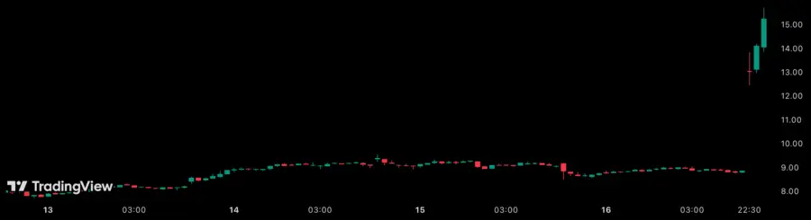

# Goodbye 2025

## 올해의 책

20권의 책을 읽었다.

### [[a-brief-history-of-intelligence]]

### [[oreilly-platform-engineering]]

### [[history-immediately-after-liberation-in-1945]]

### [[justifying-injustice]]

## 올해의 글

### [2025헌나8 대통령(윤석열) 탄핵](https://isearch.ccourt.go.kr/view.do?idx=00&docId=84503_010500)

> 피청구인 대통령 윤석열을 파면한다.

2025년 최대의 이슈였던 헌재의 윤석열 탄핵 심판 결정. 민주주의에 대한 그리고 윤석열이 민주적 기본질서를 어떻게 훼손했는지 결정문에 낱낱히 적시되어 있다.

### [역발상 전세 사기 해법, 집 주인이 대출 받게 만들어 보자](https://slownews.kr/128251)

사금융의 영역에 있는 [[jeonse]] 제도를 전세금융공사(가칭)라는 공사를 통해 제도권에 편입하자는 임재만 세종대학교 교수의 제안. 문제 의식에 공감했고, 대안도 설득력이 있었다. 매일 아침 슬로우뉴스 뉴스레터를 읽으며 출근하는데 좋은 기사가 많다. 뉴스레터는 이정환 대표가 매일 새벽 4시에 일어나 10종의 신문을 읽고 기사를 정리해 7시에 발송한다. '쉽게' 뉴스를 전해준다는 뉴스 큐레이션 서비스들이 언론의 객관성이라는 신화에 빠져서 논점을 놓칠 때, 슬로우뉴스는 해석을 제시한다.

10.15 대책 후 경제평론가 김원장을 인터뷰한 [“집값 30억 올랐는데 세금 2000만 원이 부담스럽나?”](https://slownews.kr/147227) 기사에도 정곡을 찌르는 문장이 많았다. 정부가 "세금으로 집값 안 잡는다"고 했지만, 이것이 불가능하고, 정의롭지도 않다는 이야기. 한국에서 부동산은 실패하지 않는 투자처다. 기대 수익을 줄여야 가수요를 낮출 수 있는데, 비싼 부동산을 보유해도 세금이 낮으니 내놓을 이유가 없다. 대부분의 유권자가 세금에 강한 반감을 갖지만, 정당한 조세체계를 만들지 못하면 근본적인 문제를 해결할 수 없다.

### [The case against conversational interfaces](https://julian.digital/2025/03/27/the-case-against-conversational-interfaces/)

> 알렉사나 시리와 같은 음성 인터페이스가 성공하지 못한 이유에 대해 AI가 충분히 똑똑하지 않았기 때문이라고 말하곤 하지만, 핵심 문제는 출력의 퀄리티가 아니라 입력의 불편함이었다. "헤이 구글, 오늘 샌프란시스코 날씨는 어때?"와 같은 자연어 프롬프트는 홈 화면에서 날씨 앱을 터치하는 것보다 10배 더 걸린다.

[[conversational-user-interface]]가 기존 워크플로우를 대체하는게 아니라 보완해야 한다는 주장. 사용자가 키보드 조작과 대화를 오가는 방식이 아니라, 기존 작업을 멈추지 않고 AI와 대화하며 작업을 계속 할 수 있어야 한다.

### [Tracing the thoughts of a large language model](https://www.anthropic.com/research/tracing-thoughts-language-model)

LLM이 어떻게 생각하는지 추적한 연구인데 아주 흥미로웠다. LLM이 단순히 바로 다음에 올 높은 확률의 단어를 선택할 것이라고 생각했지만, 실제로는 미리 단어를 계획한 다음에 문장을 완성했다고. 다국어 구사와 암산 부분도 재미있다. 인간이 생각하는 방식과 크게 다르지 않은 것 같지만, [[a-brief-history-of-intelligence]]을 읽고 LLM이 현실 세계를 시뮬레이션하지 않는다는 점에서 근본적인 차이가 있음을 이해했다.

### [Thoughts on thinking](https://dcurt.is/thinking)

> 나는 예전에는 글을 많이 쓰곤 했다. 아이디어가 떠오르면 적어두고, 시간을 들여 신중히 다듬어서 하나의 작품으로 만든 다음, 완성되면 세상에 공유했다. (...) 하지만 이제는 아이디어가 떠올랐을 때 엉성한 단어 몇 개만 프롬프트에 밀어 넣으면 즉시 완성된 생각이 얻어진다. AI가 아이디어를 너무나 쉽게 구체화할 수 있기 때문에, 아무리 발전된 아이디어라도 내 생각을 공유하고 싶은 마음이 덜 든다.

내가 글을 안(못) 쓰는 이유와 일맥상통해서 공감이 됐다. 누구나 자신에게 딱 맞는 도구를 만들 수 있는 시대에, 내가 만든 도구가 다른 사람에게 도움이 될 것이라는 기대를 갖기 어렵다. 내가 쉽게 만들 수 있는 것은 남들도 쉽게 만들 수 있을 테니까.

## 올해의 내 글

### [[finishing-undergraduate-in-seven-years]]

작년 8월 졸업식쯤 거의 다 써놨는데, 마무리를 미루다가 올해 1월에야 탈고했다. 2017년 3월에 입학해서 2024년 8월에 졸업했으니 7년 5개월 만에 졸업한 것이다. 블로그에 올릴 생각으로 쓰기 시작했지만 구구절절 감상을 늘어놓은 것 같아 내 정원에만 고이 모셔뒀다.

### [웹은 왜 복잡해졌나?](https://parksb.github.io/article/43.html)

1년 반 만에 글을 썼다. 웹이 복잡해진 과정을 간략히 되돌아보고, 웹을 지탱해온 하이퍼미디어라는 개념이 얼마나 강력한 힘을 가졌는지 짚어보았다. 작년에 [[hypermedia-systems]]를 읽고 하이퍼미디어에 대한 생각을 많이 했는데, 얼마 지나지 않아 해커뉴스에서 웹이 불필요하게 복잡해졌다고 주장하는 글을 읽었다. 바로 모던 웹에 대한 환멸감과 생태계가 지금과 같은 선택을 할 수 밖에 없었던 이유, 그 대안으로서 하이퍼미디어를 엮어 글을 쓰기 시작했다.

## 올해의 영화

36편의 영화를 봤다.

### 보 이즈 어프레이드

주인공이 겪는 불안과 어머니의 억압으로 인해 어른이 되지 못한 남자가 겪는 심리적 혼란을 그리는 영화. 사실 영화를 보는 중에 내용의 의미를 계속 해석하려 하기 보다는, 주인공의 감정을 온전히 경험한다는 태도로 감상하면 훨씬 와닿는다. 주인공이 놓인 상황을 한 걸음 물러나 객관적인 입장에서 바라볼 수 있는 기회가 숲의 연극 씬에서 주어지는데, 이 부분 연출이 매우 인상적이었다.

### 어쩔수가없다

범죄 영화라기에는 치밀하지 못했고, 블랙코미디라기에는 너무 현실적이었다. 차라리 형사가 첫 살인 직후 등장해서 어처구니없는 추측으로 만수가 수사망을 빠져나가는 모습을 그렸다면 어땠을까 싶었다. 만수의 아버지와 만수, 과거의 한국과 현재의 한국이 겹쳐 보였고, 만수의 아버지가 베트남에서 했던 일이 오늘 만수가 벌이는 일과 다르지 않다는 생각이 들었다. 여러모로 커리어에 대한 생각도 많이 들게 하는 영화였다.

### F1 더 무비

운전이라면 F1 뿐만 아니라 내구 레이스부터 랠리, 심지어 택시 운전까지 가리지 않는 소니 헤이스라는 캐릭터가 매력적으로 잘 만들어졌다. 벅차오르는 사운드트랙도 훌륭했고, 깔끔하게 즐거운 영화였다.

## 올해의 음악

### EROS

이찬혁의 색깔이 보다 정제된 앨범. "비비드라라러브"와 "멸종위기사랑"의 첫 공연 무대가 열린음악회였다는 점부터 신선했다.

### なんてったってAKB48

AKB48이 쇼와 시대, 헤이세이 시대, 레이와 시대 아이돌 음악을 커버한 앨범. 어쩌다보니 예비군 훈련 왔다갔다하는 4일간 반복 재생했다. "行くぜっ!怪盗少女(가자! 괴도소녀)", "LOVEマシーン(러브머신)"의 어처구니없는 MV와 가사에서 기묘한 노스탤지어가 느껴진다. 新しい学校のリーダーズ(새로운 학교의 리더즈)를 알게 된 것은 이 앨범을 통한 큰 수확이었다.

### All Hope is Gone

Slipknot의 2008년 앨범. "Psychosocial"의 템포가 내 걸음과 딱 맞아서 특히 출퇴근 길에 듣기 좋았다.

## 올해의 게임

### Roller Coaster Tycoon 2

유니버설 스튜디오 재팬을 다녀온 뒤 갑자기 꽂혀서 열심히 했다. 이후 에버랜드에 갔다가, 내가 어트랙션을 즐기는 태도가 달라졌다는 느낌이 들었다. 기존에는 어트랙션을 온전히 소비자로서 평가했다면, 이제 아주 조금은 생산자 관점을 먼저 상상해볼 수 있었다. 딱 일치하는 사례는 아니지만, <포스트디지털>에서 저자가 '비판적 제작'이 소비자본주의 체제에 저항하는 행위라고 언급한 대목이 떠올랐다. 크리스 소이어 덕분에 놀이공원이 더 재미있었다.

### Factorio

## 올해의 소비

### 스쿼시 레슨

3월부터 일주일에 두 번씩 스쿼시 레슨을 받기 시작했다. 회사 [F5 Day](https://toss.im/tossfeed/article/f5day)에 스쿼시하러 갔다가 주말내내 전혀 움직이지 못하고, '바로 이거다' 싶었다. (1) 실내에서 (2) 강도 높은 유산소 활동을 (3) 여차하면 혼자서도 할 수 있는 스포츠였기 때문이었다. 체지방률은 0.2%p 줄고, 골격근량은 2.5kg 늘었다. 다른 것보다 평상시 심박이 많이 낮아져서 만족스럽다.

### AIRism 코튼 오버사이즈 크루넥

무더웠던 지난 여름을 이 티셔츠로 버텼다. 한 벌 사서 입어봤는데 통풍도 잘 되고 질감도 만족스러워서 4장을 추가로 구입해 매일 돌려 입었다. 일본 유니클로가서 보니 반값이었다.

## 올해의 애플리케이션

### [Ice Cubes](https://github.com/Dimillian/IceCubesApp)

이름도 수상하고, 생긴 것도 수상하지만 무료 앱 중에서는 가장 상식적으로 동작하는 마스토돈 클라이언트. 여러 애플리케이션을 전전하다가 정착했다. 스크롤 복원과 스트리밍 모두 상식적으로 잘 동작하고, 공식 마스토콘 앱에서 반복되는 푸시 알림 문제도 없다.

### 카카오톡

안 좋은 의미로 올해의 애플리케이션. [if(kakao)25](https://if.kakao.com/2025) 키노트에서 카카오톡 개편에 대한 소개를 실시간으로 보면서 앱을 업데이트했다. 사실 나는 카카오톡 첫 탭에 거의 체류하지 않아서 그런지 업데이트 이후에도 사용성에는 문제가 없었다. 진짜 문제는 불편함이 아니라 불쾌함이다. 이 변화가 공급자 중심적이라는 느낌을 지울 수가 없기 때문이다. 또한 공급자가 메신저를 잘 만드는 데에는 큰 관심이 없어보인다는 점에서, 이 불쾌는 제품에 대한 신뢰의 문제이기도 하다.

### [[zed-editor]]

바이브 코딩으로 소프트웨어 장인 정신이 위협받는 시대에, 역설적으로 장인 정신이 깃들어 있는 AI 텍스트 에디터. AI 기능과 상관없이 에디터 자체로서 높은 완성도를 갖추고 있다. 대용량 텍스트 파일을 다룰 때 반응성이 뛰어나고, Vim 키 바인딩도 자연스럽게 지원한다. Claude Code를 사용하기 시작한 뒤로는 다시 Neovim으로 돌아갔지만, 여전히 응원하는 소프트웨어.

## 올해의 여행

### 중국, 베이징

친구들과 3박4일 여행을 다녀왔다. 2017년 이후 처음 떠난 해외여행이었기 때문에 여권부터 새로 발급받았다. 자금성과 천안문 광장, 싼리툰, 스차하이 등 관광지를 두루 돌아다녔다. 기온이 40도를 넘어서 이화원은 가지 못했다. (이런 날씨에도 식당에는 차가운 물이 없었다. 중국인들은 냉수를 마시지 않는다고 한다.) 물가가 정말 놀라웠는데, 북경오리가 5만원 정도, 맥주는 웬만하면 2000원 선이었다. 정산할 때마다 하루종일 지출한게 맞는지 의심될 정도로 모든 것이 저렴했다. 매일 맥주를 마셨다.

네이버페이 머니 카드만 믿고 갔다가 고생을 했다. 지하철은 카드로 결제할 수 있었는데, 버스에서 낭패를 봤다. 카드를 아에 안 받는 가게도 꽤 많아서 친구들에게 신세를 많이 졌다. 이유는 모르겠는데 안타깝게도 중국 현지에서는 알리페이나 위챗페이 가입이 안 됐다. 놀랐던건 위챗의 미니앱 시스템이었는데, 미니앱을 많이 사용한다는 건 알았지만 이렇게까지 광범위하게 사용되는 줄은 몰랐다. 식당에서 주문, 결제할 때 위챗으로 테이블의 QR 코드를 찍으면 미니앱이 열렸고, 관광지 예약도 위챗 미니앱으로 했다.

베이징은 안내 표지판보다 경고 표지판이 많고, 전광판보다 CCTV가 많은 도시였다. 그런 경직성에 비해 사람들은 아주 자유로워 보였다. 특히 도로에서 더 그랬다.

### 일본, 오사카 & 교토

중국에서 귀국하고 바로 다음주에 여자친구와 3박4일 여행을 다녀왔다. 오사카 도톤보리와 유니버설 스튜디오 재팬, 오사카 엑스포, 교토 폰토초, 겐닌지, 기요미즈데라를 갔다. 매일이 강행군이었다. 첫날 3만보를 넘게 걸었고, 이후로도 매일 2만보 넘게 걸었다.

지난 베이징 여행에서 친구가 거침없이 브로큰 차이니즈를 구사하는 것을 보고 감명받아서, 일본에서는 나도 브로큰 재패니즈를 꽤 구사해봤다. "아노... 스미마셍(저기... 실례합니다)"만 있으면 모든 의사소통이 가능했다.

2017년에도 똑같이 오사카와 교토를 여행했는데, 그때와 비교하면 정말 많은 것이 변했다. 오사카에서는 거의 모든 가게가 카드를 받았다. 2017년에도 그랬지만, 한국인이 정말(너무) 많았다. 인상적인 점은 곳곳에 접근성 시설이 잘 갖춰져 있고, 어디든 이동약자가 도움받을 수 있는 직원이 상주하고 있다는 것이었다. 휠체어 사용자가 많이 보였는데 한국에서는 이 풍경이 너무 낯설지 않나 싶었다.

## 올해의 프로젝트

### [Messenger](https://messenger.abeto.co/)

WebGL로 만든 게임. 엔지니어링 측면에서도 놀랍지만, 시청각적인 측면에서도 놀랍다. 아름다운 세계를 정처없이 탐험하는 것만으로도 즐겁다는 점에서 [Fire Watch](https://www.firewatchgame.com/)가 떠올랐다.

### [Functorio](https://github.com/konne88/functorio)

Lean 코드로 팩토리오 청사진을 만드는 프로젝트. 단순히 청사진을 코드로 작성할 수 있다는 것을 넘어서, 타입 시스템을 통한 정합성 검증과 생산/소비량 제어를 가능하게 해준다.

### [깃발들](https://flaaags.com/)

[[korean-palace-coup-2024]] 이후 각종 집회에 등장한 깃발들을 수집해 아카이브하는 프로젝트. 2016년 박근혜 탄핵 정국 당시 여당은 '전문시위꾼'이 집회를 선동하고 있고, 집회의 배후에 조직적인 반국가 세력이 있다고 주장했다. "민주묘총", "장수풍뎅이 연구회", "혼자 온 사람들" 같은 깃발은 여당의 주장을 정면으로 반박하는 해학이었다. 그때의 집회 문화가 지금까지 이어졌다는 사실이 인상적이었다.

### [Hakers' Pub](https://hackers.pub/)

## 올해의 내 프로젝트

### [Yarn Berry](https://github.com/yarnpkg/berry)

회사에서 Yarn을 사용하면서 마주한 문제를 직접 수정하고 PR을 올렸다. 한동안 정체되어 있다는 느낌을 받다가 오랜만에 오픈소스 기여를 하니 즐거웠다. 그리고 이게 회사 업무의 일환이라는 것도 이 일을 좋아하게 만든다.

- [#6935 Support escaping template variables in environment values](https://github.com/yarnpkg/berry/pull/6935)
- [#6930 Allow catalogs to work with descriptors without resolvers](https://github.com/yarnpkg/berry/pull/6930)

### [yarn-plugin-catalogs](https://github.com/toss/yarn-plugin-catalogs)

PNPM의 카탈로그 기능을 Yarn에서도 사용하기 위해 만든 플러그인. 사내 [[monorepo]]를 관리하기 위해 만든 플러그인이라서 PNPM 카탈로그와 달린 많은 추가 기능을 제공한다. Yarn이 4.10.0 버전부터 카탈로그를 공식적으로 지원하면서 위치가 좀 애매해졌는데, Yarn의 카탈로그를 확장하는 역할이 되어야 할 것 같다.

### [Tech Blog Bot](https://github.com/parksb/tech-blog-bot)

[BotKit](https://botkit.fedify.dev/)을 이용해 국내외 기술 블로그의 아티클을 업로드하는 봇을 만들었다. 트위터를 떠나고 페디버스에도 [테크크론탭](https://x.com/techcrontab/status/1982988572119425424) 같은 계정이 필요하다고 생각했다. 1시간에 한 번씩 구독중인 블로그들의 새 아티클을 확인해 큐에 넣고, 1분에 하나씩 큐의 아티클을 업로드한다. BotKit의 유려함에 첫 번째로 놀랐고, 테스트로 돌려본 봇이 스팸짓을 하는 걸 보면서 두 번째로 놀랐다. 봇은 지금도 나의 작은 홈서버에서 구동되고 있다. 

## 올해의 사건사고

- 윤석열이 탄핵됐다.
- 12년간 사용하던 SKT를 떠나 MVNO 통신사로 갈아탔다. 3개월 뒤 SKT 해킹 사태가 터졌다. 근데 나는 SKT MVNO를 사용 중이다.
- 나의 Neovim 환경을 lazy.nvim과 함께 대대적으로 개편했다: [`59a712`](https://github.com/parksb/dotfiles/commit/59a712cb261cfac1bc7f01d4cad90ee3487d258d) 업무에 Neovim을 주력으로 사용하다보니 더 이상 미룰 수 없었다.
- 올해 중순부터 직무 인터뷰에 들어가고 있다. 내가 전 직장에서 인터뷰를 얼마나 엉터리로 했는지 깨달았다. 1시간 동안 한 사람을 온전히 파악하는 것 자체가 말도 안되는 일지만, 어느정도 정형화된 패턴과 전략으로 신호를 찾을 수는 있다. 이를 깨달은 데에는 아마 세 가지 요인이 있을 것 같다: (1) 회사의 명확한 인터뷰 가이드라인, (2) 내가 입사 전 6개월간 구직 활동을 한 경험, (3) 기술적, 인성적 차원에서의 성장.
- 미국이 중국과 무역전쟁을 벌였다. X축을 늘려서 마음을 다잡았다.
- 4개월 들고 있다가 -28% 손실보고 매도한 주식이 다음날 70% 상승했다. 속이 쓰렸지만 퀀트 투자를 하고 있기 때문에 눈물을 흘리지는 않았다.
  
- 자바스크립트 모듈 시스템에 대해 많은 공부를 했고, 정말 많은 고통을 겪었다.
- 대규모 [[monorepo]]에서 Yarn을 사용하면서 실전적인 경험을 쌓았다.
- 팀 플레이샵에 참석했다. 어쩌다보니 팀원들과 BL 웹툰 콜라보 카페를 갔다.
