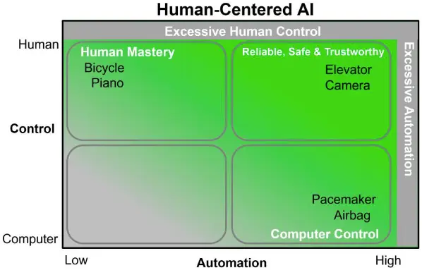

# Human-Centered Artificial Intelligence: Reliable, Safe & Trustworthy

::: INFO
[Ben Shneiderman, "Human-Centered Artificial Intelligence: Reliable, Safe & Trustworthy", 2020](https://arxiv.org/abs/2002.04087)
:::

인간중심 [[artificial-intelligence]](Human-Centered Artificial Intelligence, HCAI)을 위한 2차원 프레임워크를 제시한다.  지금까지 [[artificial-intelligence]] 연구자와 개발자들은 제어권과 자동화를 1차원적으로 생각해왔다. 즉, 하나의 축 위에서 인간에게 모든 것을 맡길 것인지, 기계에게 모든 것을 맡길 것인지만을 비교한 것이다. 이제는 여기에서 벗어나 2차원적 HCAI 프레임워크를 고려해야 한다.

프레임워크의 한 축은 제어권이 누구에게 있는지 의미하며, 다른 한 축은 자동화의 수준을 의미한다. HCAI의 목적은 사람이 더 많은 제어권을 가지는 동시에 높은 자동화 수준을 달성하는 것이다. 이 지점에서 컴퓨터 애플리케이션은 보다 일관적이고, 안전하며, 신뢰할 수 있게(Reliable, Safe & Trustworhy, RST) 된다.

양 축의 극단에는 초과 자동화와 초과 인간 제어 영역이 있다. 초과 자동화는 시스템이 실패하지 않는다는 가정에서 비롯되기 때문에 문제가 생겼을 때 인간 사용자가 직접 문제를 해결할 방법을 제공하지 않는다. 한편, 초과 인간 제어는 사용자에게 모든 제어를 맡겨 인적오류를 유발한다.

RST 시스템을 위한 6가지 설계 원칙을 제안한다:

- 사용자의 의도를 실현, 표현, 수정할 수 있는 일관된 인터페이스.
- 사용자가 관심있는 대상과 동작을 지속적으로 표시.
- 신속하고 점진적이며 가역적인 동작.
- 사용자의 각 행위에 대한 유용한 피드백.
- 상태를 표시하는 프로그레스 인디케이터.
- 결과를 확인할 수 있는 완료 보고.

## 관련문서

- [[human-computer-interaction]]
