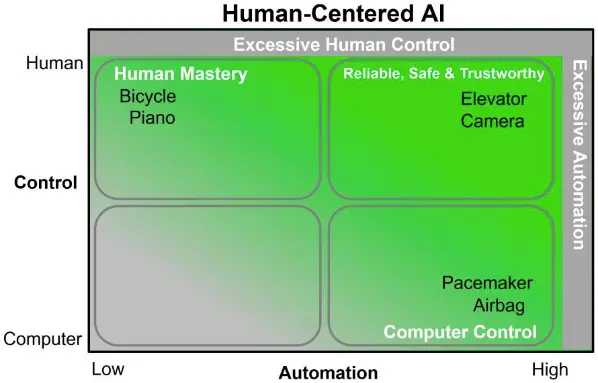

# Human-Centered Artificial Intelligence: Reliable, Safe & Trustworthy

::: INFO
[Ben Shneiderman, "Human-Centered Artificial Intelligence: Reliable, Safe & Trustworthy", 2020](https://arxiv.org/abs/2002.04087)
:::

인간중심 [[artificial-intelligence]](Human-Centered Artificial Intelligence, HCAI)을 위한 2차원 프레임워크를 제시한다.  지금까지 [[artificial-intelligence]] 연구자와 개발자들은 제어권과 자동화를 1차원적으로 생각해왔다. 즉, 하나의 축 위에서 인간에게 모든 것을 맡길 것인지, 기계에게 모든 것을 맡길 것인지만을 비교한 것이다. 더 많은 자동화는 암묵적으로 더 적은 인간 제어를 의미했다. 두 개념을 분리하면 2차원 HCAI 프레임워크를 고려하게 된다. 이 프레임워크는 높은 수준의 인간 제어와 높은 수준의 자동화를 함께 달성할 수 있음을 보여준다.

프레임워크의 한 축은 제어권이 누구에게 있는지 의미하며, 다른 한 축은 자동화의 수준을 의미한다. HCAI의 목적은 사람이 더 많은 제어권을 가지는 동시에 높은 자동화 수준을 달성하는 것이다. 이 지점에서 컴퓨터 애플리케이션은 보다 일관적이고, 안전하며, 신뢰할 수 있게(Reliable, Safe & Trustworhy, RST) 된다.

바람직한 목표는 흔히 제1사분면에 있지만, 항상 그런 것은 아니다. 대부분의 RST 시스템은 제1사분면이나 제4사분면에 있다. 사용 맥락이 다양하고 제대로 이해하기 어려운 복잡한 작업은 제1사분면을 달성해야 한다. 자동화 수준이 높고, 인간 제어가 낮은 제4사분면은 신속한 행동이 필요한 컴퓨터 자율성의 영역이다. 가령 에어백이나 제동장치, 페이스메이커, 방어 무기 체계가 있다. 이러한 시스템에는 인간이 개입하거나 제어할 시간이 없다. 실패의 대가가 매우 크기 때문에 극도로 세심한 설계와 광범위한 실험이 필요하며, 대규모 실사용 환경에서도 설계를 개선하기 위한 모니터링이 필요하다. 효과가 입증된 설계는 더 높은 자동화와 더 적은 인간 감독을 갖춘 RST 시스템이 될 수 있다.

양 축의 극단에는 과도한 자동화와 과도한 인간 제어 영역이 있다. 과도한 자동화는 시스템이 실패하지 않는다는 가정에서 비롯되기 때문에 문제가 생겼을 때 인간 사용자가 직접 문제를 해결할 방법을 제공하지 않는다. 여기에는 보잉 737 MAX의 MCAS 결함과 같은 위험이 존재한다. 설계자들은 자율 시스템이 실패할리 없다고 믿었기 때문에 시스템의 존재를 매뉴얼에 기재하지 않았으며, 조종사도 수동으로 전환하는 방법을 훈련받지 못했다. IBM AI 지침은 현명하게도 "감지할 수 없는 AI는 윤리적인 AI가 아니다"라고 경고한다. 한편, 과도한 인간 제어는 사용자에게 모든 제어를 맡겨 인적오류를 유발한다. 인간의 실수는 설계 실패로 봐야한다. 자동화 제어, 인간공학적 어포던스는 인간의 실수에서 비롯되는 치명적인 결과를 방지하기 위해 만들어진 설계 전략이다.

HCAI라는 새로운 목표는 인공지능을 추구하는 사람들과 지능 증강을 추구하는 사람들 사이의 간극을 극복한다. 성공적인 설계는 이해 가능하고, 예측 가능하며, 통제 가능하다. 결과적으로 사용자의 자기효능감을 높일 수 있고, 신뢰할 수 있으며, 안전하고, 믿을만한 시스템으로 이어진다. 이러한 시스템을 위한 설계 원칙을 '프로메테우스 원칙'이라고 부르고자 한다.

1. 사용자의 의도를 실현, 표현, 수정할 수 있는 일관된 인터페이스.
1. 사용자가 관심있는 대상과 동작을 지속적으로 표시.
1. 신속하고 점진적이며 가역적인 동작.
1. 사용자의 각 행위에 대한 유용한 피드백.
1. 상태를 표시하는 프로그레스 인디케이터.
1. 결과를 확인할 수 있는 완료 보고.

HCAI 프레임워크는 사람과 컴퓨터가 서로 다르다는 믿음에 기초한다. 정교한 알고리즘, 고급 센서, 풍부한 정보를 담은 디스플레이, 강력한 구동 장치 등 컴퓨터 고유의 특성을 활용하는 설계는 수행 능력을 증강할 가능성이 크다. 마찬가지로 인간 고유의 능력을 인정하는 시스템 설계와 조직 구조에는 혁신적인 사용을 장려하고, 지속적인 개선을 지원하며, 훨씬 뛰어난 설계를 이끌어낼 수 있다.

## 관련문서

- [[human-computer-interaction]]
