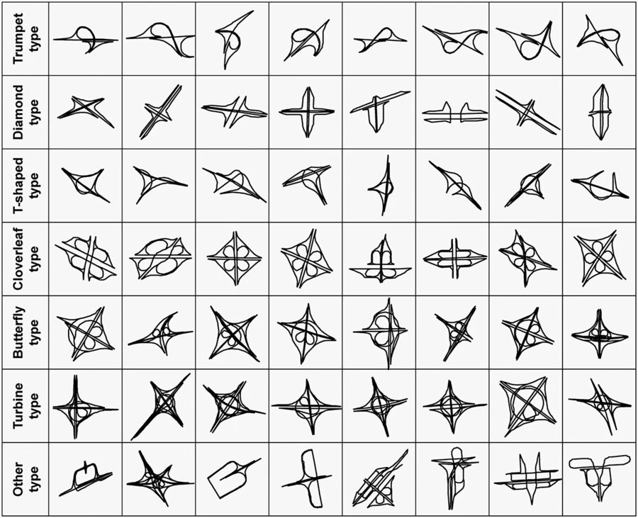

# 교차로

교차로는 두 개 이상의 길이 만나는 한 지점을 의미한다.

## 입체교차로

입체교차로는 교차로를 지나는 차량이 정차할 필요가 없도록 교량 등을 이용해 입체화한 교차로를 말한다. 고속도로와 일반 도로가 만나는 교차로는 나들목(Interchange, IC)라고 하며, 고속도로 또는 고속화도로끼리 만나는 교차로는 분기점(Junction, JC)라고 한다.

_입체교차로의 종류_
