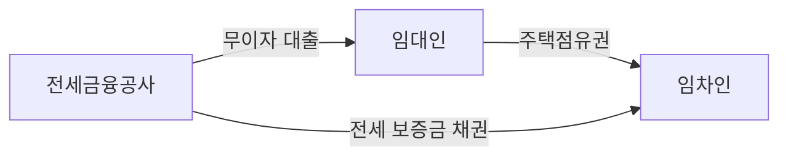

# 전세

부동산에서 전세(傳貰)는 한국의 주택 임차 계약 중 한 형태다. 임차인(전세권자)이 전세금을 임대인에게 예탁하는 조건으로 주택을 임차한 뒤, 계약 기간이 끝나면 전세금을 전액 돌려받는 방식이다. 현행 전세 제도는 기본적으로 집을 담보로 한 개인간의 대출로서, 사금융으로 봐야한다. 

## 전세금융공사

::: INFO
[김도연, "역발상 전세 사기 해법, 집 주인이 대출 받게 만들어 보자", 2025](https://slownews.kr/128251)
:::

세입자가 대출을 받아 전세금을 마련해야 하는 현행 전세 제도에 대해 임재만 세종대학교 교수가 제시한 대안이다. 세입자가 금융기관으로부터 대출을 받아 임대인에게 보증금을 지급하고, 그 반대급부로 입대인이 임차인에게 주택점유권을 제공하는 현행 전세 제도에서는 임대인이 보증금을 돌려주지 않는 경우 세입자가 손해를 떠안아야 한다.

임재만 교수는 전세금융공사(가칭)을 설립해 임대인이 전세금융공사가 발행하는 무이자 주택담보 대출을 받고, 임차인은 공사가 발행하는 전세 보증금 채권을 매입하게 하자고 제안한다. 전세 계약이 종료될 때 임대인은 공사에 대출을 상환하고 공사는 임차인에게 채권 원금을 상환하면 된다.

만약 임대인이 대출을 상환하지 못하는 경우에는 전세금융공사가 임차인에게 보증금을 즉시 상환한 뒤 경매권을 실행해 대출 원금을 회수한다. 사금융의 영역에 있는 전세 제도를 제도권에 편입해 투명성을 높이자는 취지인데, 임대인들이 굳이 대출을 받으며 전세를 놓을 유인이 있는지 의문이라는 지적이 있다.
