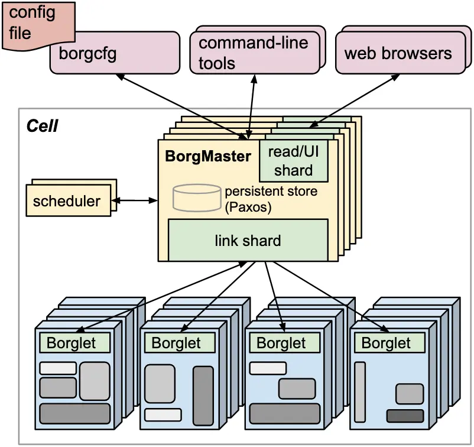

# Large-scale cluster management at Google with Borg

::: INFO
[Abhishek Verma et al., "Large-scale cluster management at Google with Borg." _Proceedings of the Tenth European Conference on Computer Systems_. 2015](https://dl.acm.org/doi/10.1145/2741948.2741964)
:::

구글의 Borg 시스템은 수천 개의 다양한 애플리케이션과 수백만 개의 작업을 구동하기 위한 클러스터 매니저다. Borg를 사용했을 때 이익은 크게 세 가지가 있다: (1) 리소스 관리과 장애 대응의 디테일을 감춤으로써 사용자가 애플리케이션 개발에만 집중할 수 있게 해준다. (2) 높은 신뢰성과 가용성을 제공한다. (3) 수만 대의 머신에서 실행되는 워크로드를 효과적으로 실행할 수 있게 해준다.

Borg 사용자는 구글 개발자와 SRE 엔지니어다. 사용자는 각 셀(cell)에 자신의 작업(job)을 등록할 수 있다. 하나의 셀은 여러 대의 머신으로 구성되며, 같은 셀에 포함된 머신들은 하나의 클러스터에 속하게 된다. 이때 중앙집중된 컨트롤러를 Borgmaster라고 부르며, 각 머신에서 실행되는 에이전트 프로세스를 Borglet이라고 한다.

_Borg의 고수준 아키텍처. 수천 개의 워커 노드 중 일부만 묘사한다._

Borgmaster의 메인 프로세스는 작업 생성, 조회 등 클라이언트의 RPC를 처리한다. Borgmaster는 논리적으로 하나의 프로세스이지만, 실제로는 5개 복제본이 셀의 상태를 각자 Paxos 기반 저장소에 저장한다. 셀에 작업이 등록되면 Borgmaster는 이를 Paxos 저장소에 기록하고 작업의 태스크를 pending 큐에 넣는다. 큐는 스케줄러에 의해 비동기적으로 스캔되며, 스케줄러는 각 태스크를 적절한 머신에 할당해준다.

Borglet은 셀 내의 머신을 표현하는 에이전트로, 할당된 태스크를 수행할 수 있다. Borgmaster는 각 Borglet을 주기적으로 폴링하면서 머신의 현재 상태를 체크한다.

## 관련문서

- [[kubernetes]]
