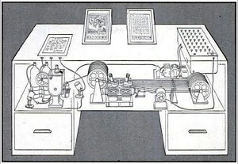

# 메멕스

메멕스(Memex, Memory expansion)는 개인의 모든 기록과 지식, 경험 등을 저장할 수 있는 가상의 기계 장치로, 1945년 버니바 부시(Vannevar Bush)가 [[as-we-may-think]]에서 소개했다. 이 아이디어는 훗날 하이퍼텍스트의 개발에 영감을 주었으며, 월드 와이드 웹과 개인 지식 베이스 시스템의 등장으로도 이어졌다.

부시는 2차 세계대전 이후 과학기술이 어떤 역할을 해야 하는지 논하면서, 전쟁 중 쏟아진 방대한 연구 결과물을 공유하고, 각 분야를 서로 연결하는 시스템이 필요하다고 언급했다. 당시에는 수많은 정보를 한 개인이 처리할 수 있는 기술이 없었기 때문에 부시는 기존 지식을 검색하기 위해 과도한 시간을 들여야 한다는 사실을 우려했다. 그는 이러한 문제를 해결하기 위한 장치로서 메멕스를 제안했다.

메멕스는 마이크로필름과 리더를 하나의 책상에 통합한 형태로 제안되었다. 책상 한쪽에는 자료를 스캔할 수 있는 반투명한 스크린이 있다. 책이나 손으로 쓴 메모, 사진 등 시각 자료를 스크린 위에 올리고 레버를 당기면 이를 필름에 저장할 수 있다. 저장된 정보는 자동으로 인덱싱되기 때문에 특정 정보를 찾을 때는 해당 정보의 코드를 입력해서 쉽게 검색할 수 있다. 메멕스의 핵심적인 기능은 연관 인덱싱으로, 사용자가 원하는 정보를 다른 정보와 연결할 수 있는 기능이다. 두 정보를 나란희 띄우고 연결 코드를 입력하면 두 정보가 연결되어 나중에 하나의 경로를 통해 함께 조회할 수 있다.

## 관련문서

- [[human-computer-interaction]]
