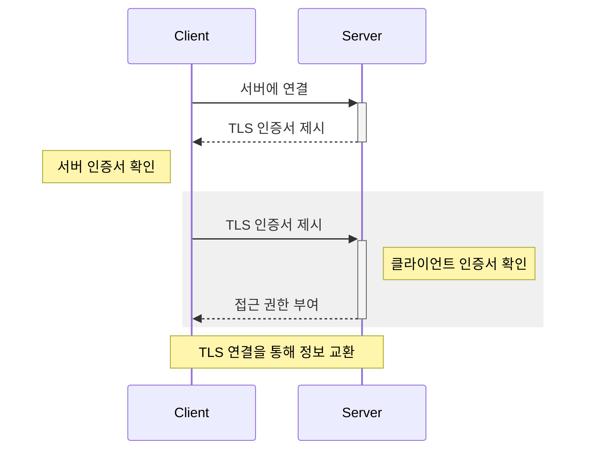

# mTLS

mTLS(mutual TLS)는 [[computer-network]]로 통신하는 양 당사자가 올바른 개인 키를 가지고 있는지 확인함으로써 신원을 증명하는 상호 인증 방식이다.

기본적으로 TLS 프로토콜은 서버 측의 X.509 인증서를 사용해 클라이언트에게 서버의 신원을 증명한다. 이때 클라이언트의 신원 증명은 애플리케이션 계층에 위임한다. 한편 mTLS는 클라이언트에도 인증서를 보관해 클라이언트와 서버 모두의 신원을 증명한다.

위 다이어그램에서 밝은 회색으로 표시된 구간은 mTLS에서만 수행하는 과정이다.

## 참고자료

- ["What is mutual TLS (mTLS)?", Cloudflare](https://www.cloudflare.com/learning/access-management/what-is-mutual-tls/)
