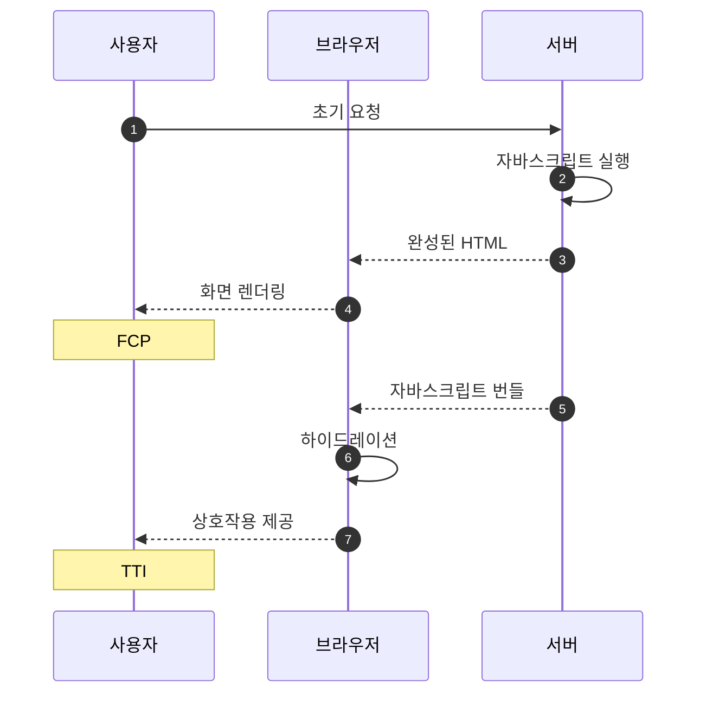
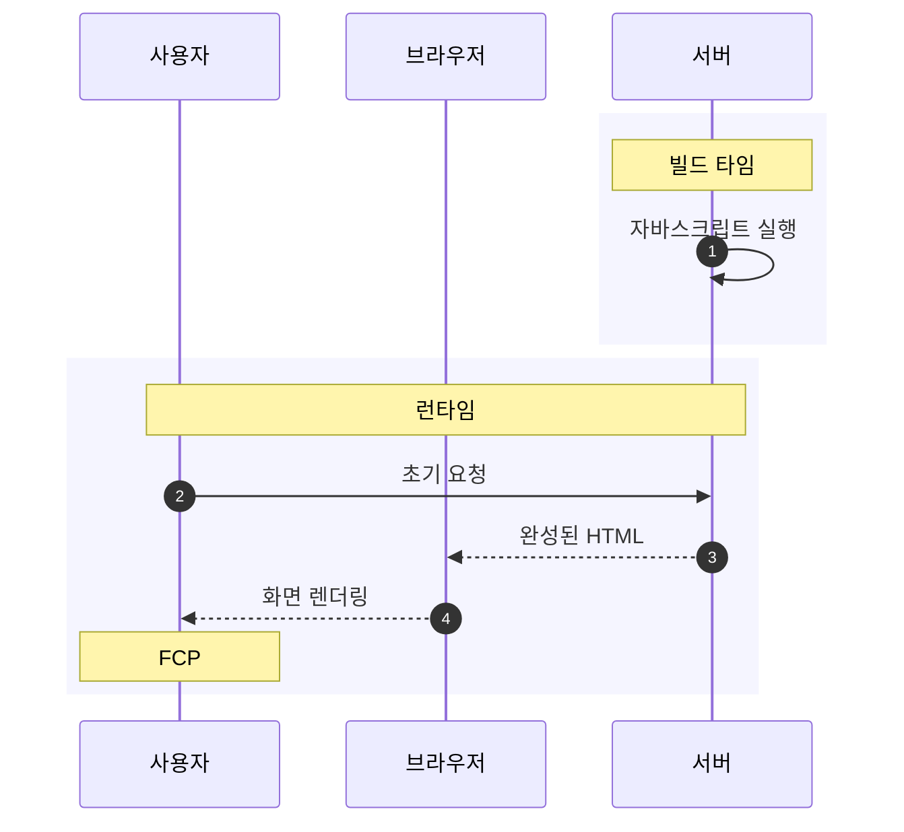
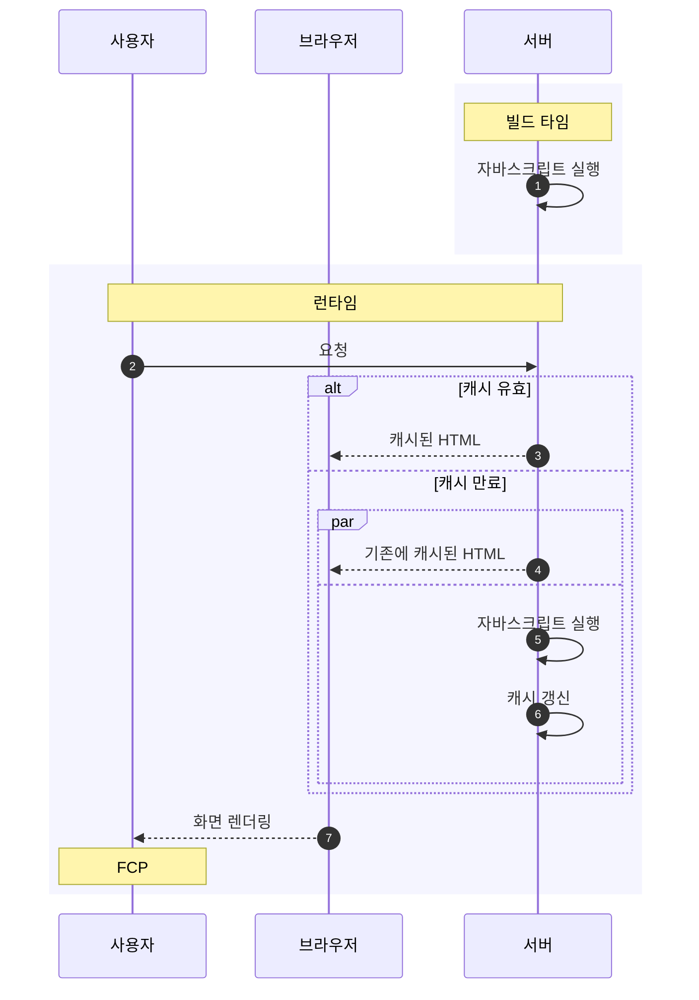

# Next.js

::: INFO
https://nextjs.org/
:::

Next.js는 [[react]] 기반의 웹 프레임워크로, 서버 사이드 렌더링(SSR)을 지원한다.

## 라우팅 방식

- 페이지 라우팅(Page routing): `pages` 디렉토리 하위에 있는 파일과 디렉토리 구조를 URL 경로로 매핑하는 라우팅 방식이다.
- 앱 라우팅(App routing): [[react-server-component]], 스트리밍 등 추가 기능을 제공하는 새로운 라우팅 방식이다.

## 렌더링 방식

### SSR (Server-Side Rendering)

서버 사이드 렌더링은 서버가 클라이언트의 접속 요청을 받을 때마다 페이지를 매번 새롭게 생성해 완성된 HTML을 응답하는 사전 렌더링 방식이다. 최신 데이터의 반영이 중요한 페이지에 적합하지만, 매 요청마다 페이지를 새롭게 생성하기 때문에 서버에서 부하를 유발하거나 응답 속도가 늦어질 수 있다.



SSR을 적용하려면 페이지 컴포넌트에서 `getServerSideProps` 함수를 선언하고 내보내면 된다. `getServerSideProps` 함수는 사전 렌더링에서 페이지 컴포넌트보다 먼저 실행되어 서버에서 페이지 컴포넌트에 필요한 로직을 실행하고, 그 결과를 페이지 컴포넌트에 프로퍼티로 전달한다.

```javascript
export function getServerSideProps() {
    const data = "Hello, world!";
    return { props: { data } };
}

export default function Home({ data }) {
    console.log(data); // "Hello, world!"
    return (...);
}
```

### SSG (Static Site Generation)

정적 사이트 생성은 빌드 타임에 미리 완성된 HTML을 생성해두는 사전 렌더링 방식이다. 런타임에서 클라이언트의 요청을 받으면 빌드 타임에 미리 생성해둔 HTML을 응답하기 때문에 지연없이 응답할 수 있다. 다만, 나중에 데이터가 업데이트되더라도 빌드 타임에 미리 생성해둔 HTML은 변경되지 않기 때문에, 최신 데이터의 반영이 중요한 페이지에는 적합하지 않다. 만약 SSG 방식으로 페이지를 생성한 뒤 데이터를 변경해야 한다면 클라이언트에서 데이터를 요청해 업데이트해야 한다.



SSG를 적용하려면 페이지 컴포넌트에서 `getStaticProps` 함수를 선언하고 내보내면 된다. `getStaticProps` 함수는 빌드 타임에 실행되어 페이지 컴포넌트에 필요한 로직을 실행하고, 그 결과를 페이지 컴포넌트에 프로퍼티로 전달한다.

```javascript
export function getStaticProps() {
    const data = "Hello, world!";
    return { props: { data } };
}

export default function Home({ data }) {
    console.log(data); // "Hello, world!"
    return (...);
}
```

개발 모드에서는 코드 수정 사항을 빠르게 반영하기 위해 SSG 방식임에도 접속 요청을 받을 때마다 페이지를 매번 새롭게 생성한다.

### ISR (Incremental Static Regeneration)

증분 정적 재생성은 SSG 방식으로 빌드 타임에 생성한 정적 페이지를 일정 주기마다 다시 생성해 최신 데이터를 반영하는 렌더링 방식이다. 일정 시간이 지나기 전까지는 빌드 타임에 생성해 캐시해둔 HTML을 응답하고, 시간이 지나 캐시가 만료되면, 만료된 HTML을 응답하는 동시에 백그라운드에서 새 HTML을 생성해 캐시한다. 빠른 응답과 최신 데이터의 반영을 동시에 달성할 수 있는 방식이다.



ISR을 사용하려면 페이지 컴포넌트에서 `getStaticProps` 함수에 `revalidate` 옵션을 설정하면 된다. `revalidate` 옵션은 페이지가 캐시된 후 다시 생성되기까지의 시간을 초 단위로 지정한다.

```javascript
export function getStaticProps() {
    const data = "Hello, world!";
    return { props: { data }, revalidate: 10 }; // 10초마다 재생성
}

export default function Home({ data }) {
    console.log(data); // "Hello, world!"
    return (...);
}
```

ISR은 데이터의 갱신 시점을 예측하기 어렵다. 만약 `revalidate` 주기가 60초라면, 사용자는 최대 60초 동안은 만료된 데이터를 보게 된다. 이 문제를 해결하기 위한 렌더링 방식이 주문형 재생성(On-demand ISR)으로, 일정 주기에 따라 페이지를 재생성하는 대신 API를 통해 페이지를 재생성할 수 있다.
