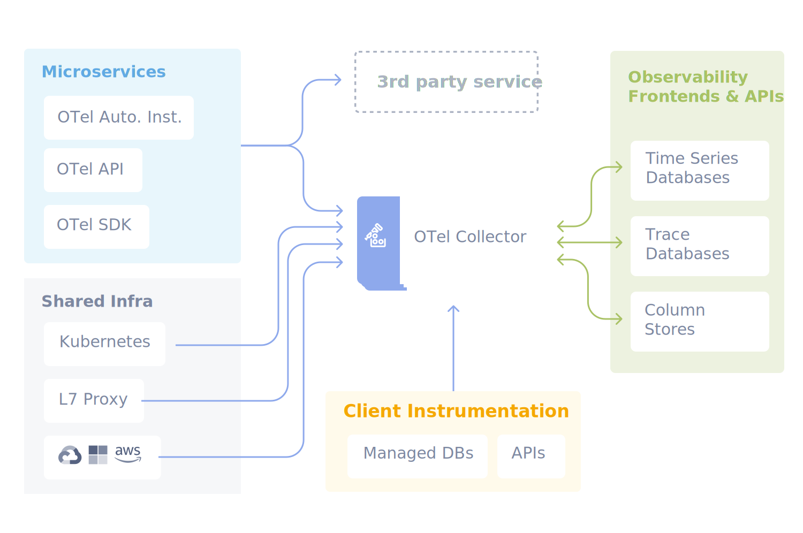

# OpenTelemetry

::: INFO
https://opentelemetry.io/
:::

오픈텔레메트리(OpenTelemetry, OTel)는 오픈소스 통합 가시성 프레임워크다. 오픈텔레메트리는 벤더 중립적인 SDK와 API를 제공하기 때문에 다양한 가시성 백엔드에 계측 데이터를 전송할 수 있다. 기존에는 인프라나 애플리케이션의 메트릭을 특정 벤더가 제공하는 가시성 백엔드에 전송하는 경우, 해당 벤더의 API에 락인(lock-in)되어 다른 벤더로 전환해야 할 때 높은 전환 비용이 발생한다. 이때 오픈텔레메트리는 표준 어댑터와 같은 역할을 한다.
