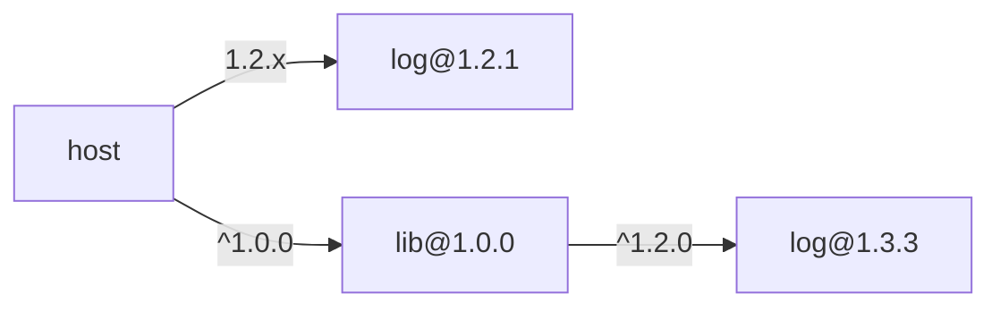
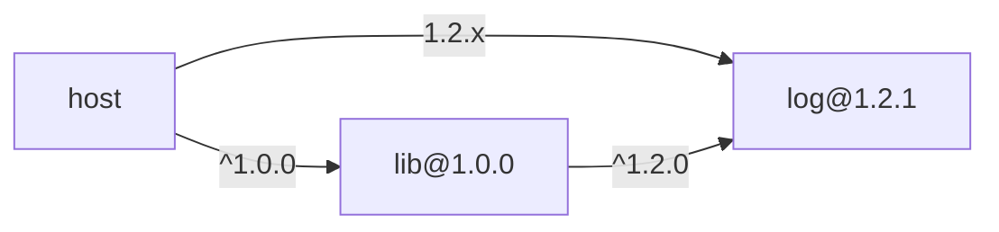
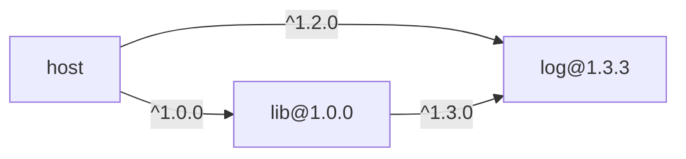
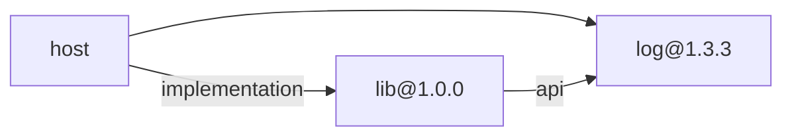

# 피어 의존성

피어 의존성(peer dependencies)은 패키지가 사용하는 의존성을 직접 의존하지 않고 호스트가 제공해주길 기대하는 의존성이다.

패키지 개발자가 피어 의존성을 명시하면 사용처에서 의존성의 싱글톤을 유지하고, 호환되는 의존성의 버전 범위를 제한할 수 있다. 만약 `host` 패키지가 직접 `log@1.2.1` 패키지를 사용하고, `host` 패키지가 의존하는 `lib` 패키지가 `log@^1.2.0` 패키지(실제로는 `log@1.3.3`)를 사용하면 아래와 같은 의존성 그래프가 만들어진다.

이때, `host` 패키지에서 사용하는 `log@1.2.1`의 인스턴스와 `lib` 패키지에서 사용하는 `log@1.3.3`의 인스턴스가 달라서 싱글톤이 유지되지 않는다. 이때 `lib` 패키지가 `log`를 피어 의존성으로 명시하면 `host`의 `log@1.2.1` 패키지를 사용하게 되어서 싱글톤을 유지할 수 있다.

이때 `lib`이 요구하는 피어 의존성 `log`의 버전 범위는 `1.2.1`을 포함할 수 있어야 한다.

## 사례

### Node.js

Node.js에서는 `package.json` 파일에 `peerDependencies` 속성을 명시해서 피어 의존성을 명시할 수 있다. 참고로 Deno에는 이와 같은 개념이 없다.

### Cargo

[[rust]]의 Cargo는 [[semver]] 기반으로 호환 가능한 버전을 발견하면 의존성을 하나로 통합한다. 만약 `host` 패키지가 `log@^1.2.0`에 의존하고, `lib` 패키지가 `log@^1.3.0`에 의존(실제로는 `log@1.3.3`)한다면 `^1.2.0` 범위가 `1.3.3`을 포함하므로 `log` 의존성은 `lib` 패키지가 사용하는 `1.3.3` 버전으로 통합된다.

만약 버전 범위가 맞지 않아 두 버전이 공존하게 되면 문제가 발생할 수 있다. 이러한 문제를 피하기 위해 『The Cargo Book』은 라이브러리를 만들 때는 의존성 버전의 상한을 제한하지 말라고 권고[^the-cargo-book]한다.

### Gradle

JVM의 Gradle은 의존성을 `api`와 `implementation` 두 종류로 구분한다. `api` 의존성은 의존성의 타입이 라이브러리의 공개 API로 노출된다. `implementation` 의존성은 내부에서만 사용된다. 만약 `lib` 패키지가 `log` 패키지를 `api`로 선언해 의존하면 `log`가 `host`에 전이적으로 포함된다. 

또한 Gradle에서는 종속성을 `compileOnly`로 선언할 수 있다. `compileOnly` 의존성은 컴파일 타임에만 필요하고 런타임에는 포함되지 않는 의존성이다. 즉, 패키지가 정상적으로 동작하려면 `compileOnly` 의존성이 필요할 수 있지만, 런타임에 포함되지 않으므로 사용처에서 의존성을 제공해야 한다.

## 참고자료

- [Stephen Coakley, "How Rust Solved Dependency Hell", 2019](https://stephencoakley.com/2019/04/24/how-rust-solved-dependency-hell)
- [Armin Ronacher, "Proposal: Explicit External Dependencies and External Dependency Pinning", 2016](https://github.com/rust-lang/cargo/issues/2791)

[^the-cargo-book]: ["Specifying Dependencies", The Cargo Book](https://doc.rust-lang.org/cargo/reference/specifying-dependencies.html)
