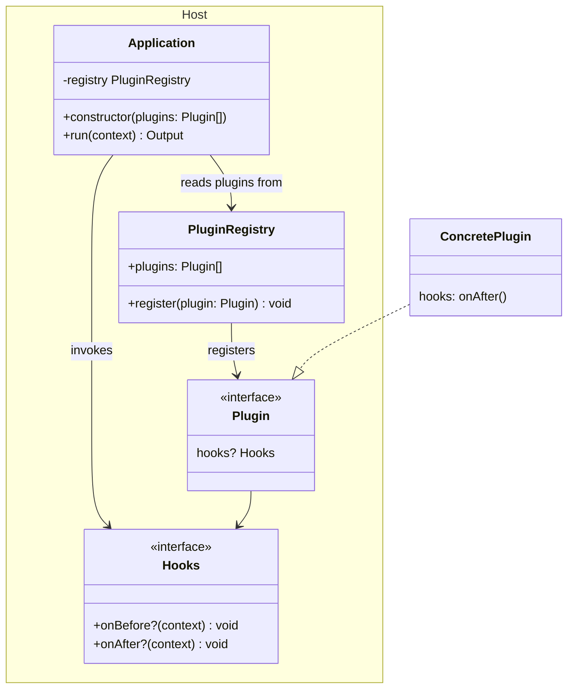

# 플러그인 시스템

플러그인 시스템은 소프트웨어의 기능을 외부에서 확장할 수 있도록 설계된 시스템이다.

## 설계

플러그인 시스템에서 호스트 시스템은 외부에 플러그인 인터페이스를 제공한다. 이 인터페이스는 호스트 시스템과 외부 시스템 사이의 계약이다. 플러그인 인터페이스를 준수하는 컴포넌트는 무엇이든 호스트 시스템의 플러그인이 될 수 있다.



위 다이어그램에서 `Application`은 초기화 시점에 `PluginRegisty`를 통해 플러그인을 등록한다. 등록된 플러그인은 `Plugin` 인터페이스를 구현하는 컴포넌트이며, 여기에서는 예시로 `ConcretePlguin`이 `Hooks`의 `onAfter()`를 구현하고 있다. 이후 `Application`의 주요 실행 흐름에서 플러그인을 사용한다.

```ts
class Application {
  private registry = new PluginRegistry();

  constructor(plugins: Plugin[]) {
    for (const plugin of plugins) {
      this.registry.register(plugin);
    }
  }

  run(context: Context): Output  {
    for (const plugin of this.registry.plugins) {
      plugin.hooks?.onBefore?.(context);
    }

    // do something...

    for (const plugin of this.registry.plugins) {
      plugin.hooks?.onAfter?.(context);
    }

    return output;
  }
}
```

`Application`을 사용하는 측에서는 사용하고 싶은 플러그인을 주입해 호스트 시스템에 적용할 수 있다.

## 장점과 단점

플러그인 시스템의 가장 큰 장점은 시스템이 유연해진다는 점이다. 시스템 자체를 수정하지 않고도 사용처의 요구사항에 맞게 내부 동작을 변형할 수 있다. 이는 시스템의 핵심부와 주변부가 자연스럽게 구분된다는 의미이기도 하다. 새로운 기능을 추가할 때도 핵심부를 수정할 필요가 없으니 더욱 과감하게 다양한 기능을 지원할 수 있다. 만약 새로 도입한 기능에 문제가 있어도 원인을 쉽게 특정할 수 있고, 제거하는 것도 어렵지 않다. 또한 자연스럽게 명세와 구현이 구분된다는 장점도 있다. 꼭 제3자를 위한 플러그인 시스템을 만드는 것이 아니더라도, 플러그인을 고려한 시스템을 설계한다면 모듈성을 높일 수 있다.

단점은 명세가 충분히 열려 있지 않은 경우 확장이 오히려 어려워진다는 점이다. 플러그인을 통해 새로운 기능을 구현하려고 하는데, 해당 기능이 플러그인 인터페이스에 포함되어 있지 않을 수 있다. 모놀리식 시스템이라면 호스트 시스템의 특정 구현만 수정하면 된다. 그러나 플러그인 시스템에서는 호스트 시스템이 정의하는 명세를 모두 수정한 뒤, 플러그인의 구현을 작성해야 한다.

## 참고자료

- [Maël Nison, 『Plugin systems - when & why?』, 2019.](https://dev.to/arcanis/plugin-systems-when-why-58pp)

## 관련문서

- [[software-engineering]]
- [[platform-engineering]]
- [[unix-philosophy]]
- [[yarn]]
- [[peer-dependencies]]
