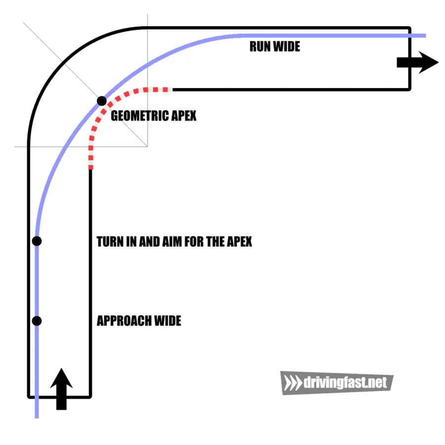
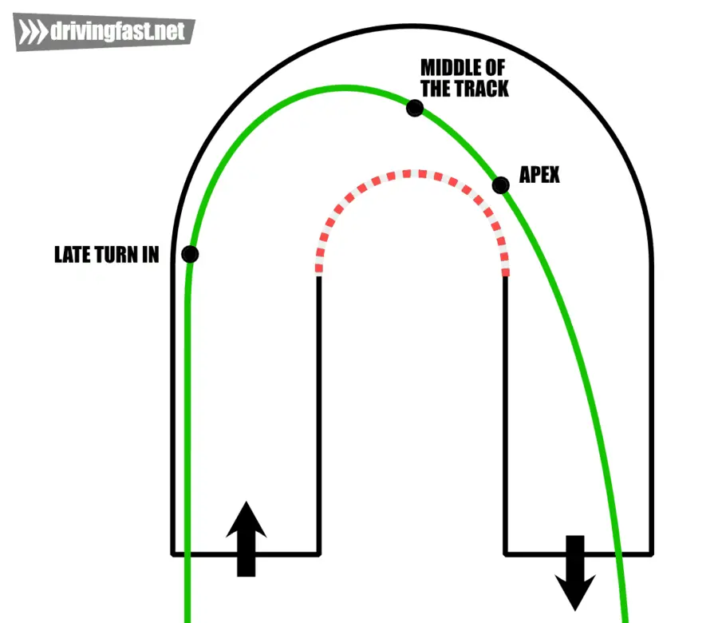

# 레이싱 라인

레이싱 라인(Racing line)은 레이스 코스에서 가장 빠르게 주행할 수 있는 최적 경로를 말한다.

_전통적인 레이싱 라인_

_헤어핀의 레이싱 라인_

## 참고자료

- [Vox, "How F1 racers turn really fast", 2022](https://www.youtube.com/watch?v=KBXMan0Dafw)
