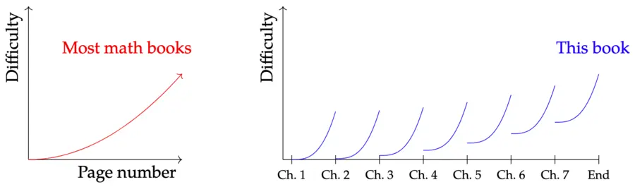

# Seven Sketches in Compositionality

> [Brendan Fong et al., "Seven Sketches in Compositionality: An Invitation to Applied Category Theory", 2018](https://arxiv.org/abs/1803.05316)

대부분의 수학 책들은 페이지 번호에 따라 난이도가 단조 증가하지만, 이 책의 난이도는 한 챕터 안에서만 단조 증가한다.

