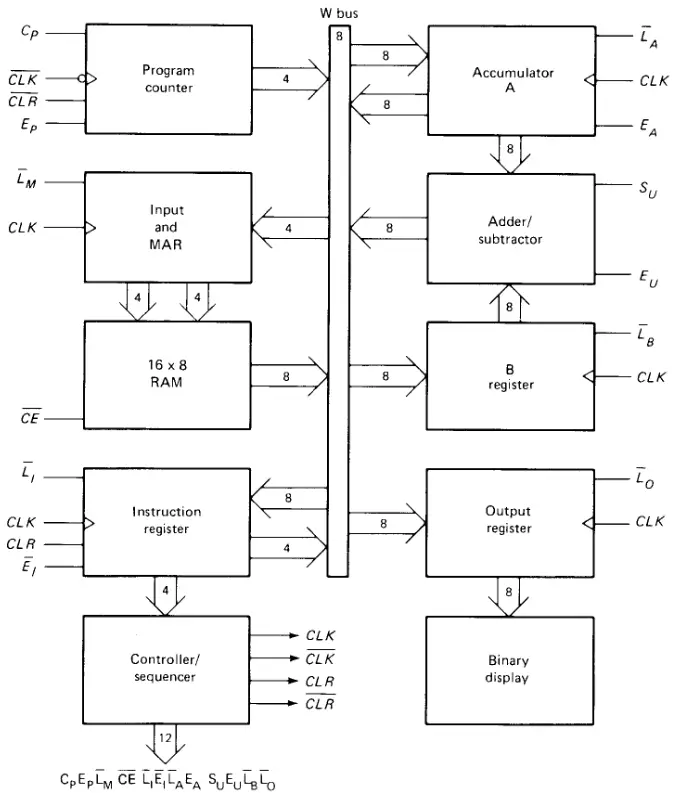
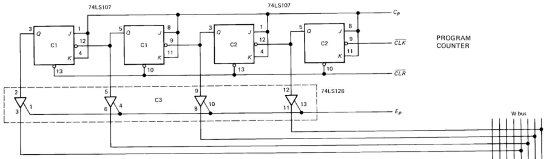
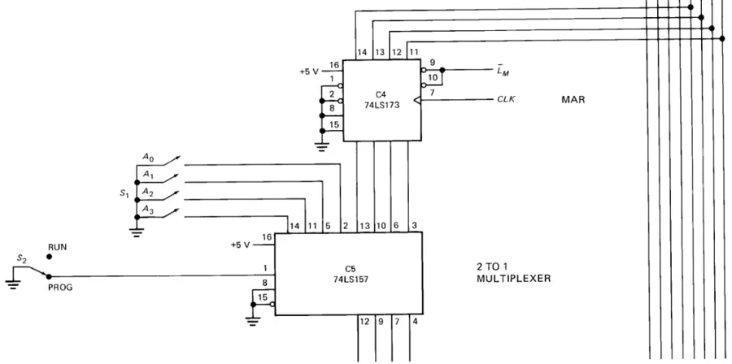
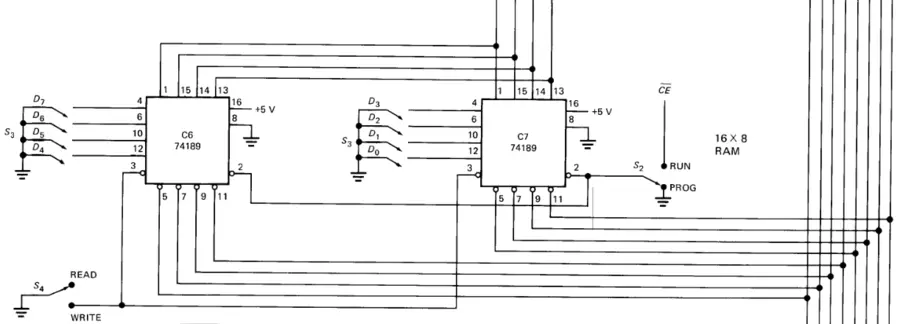
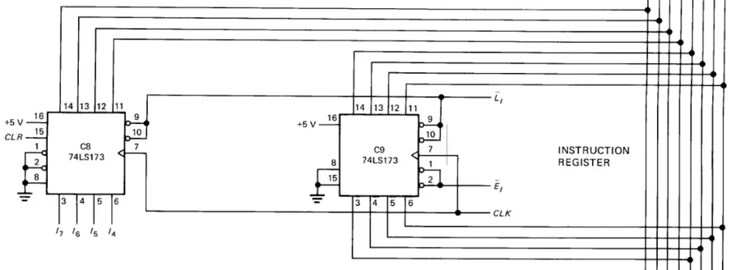
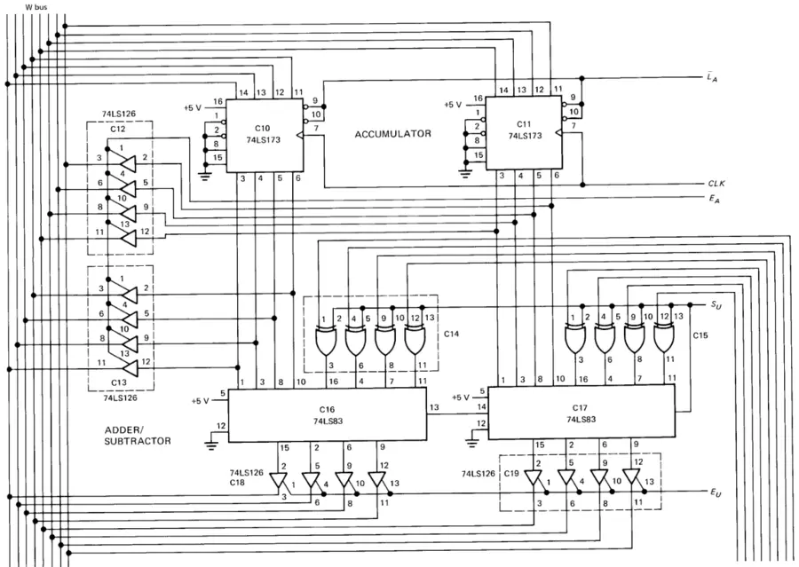
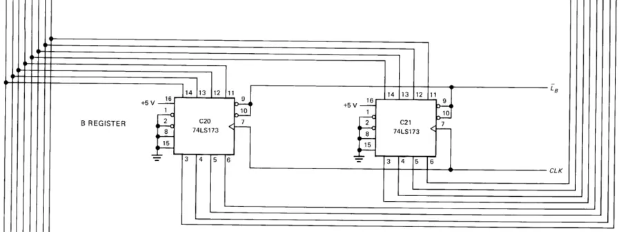
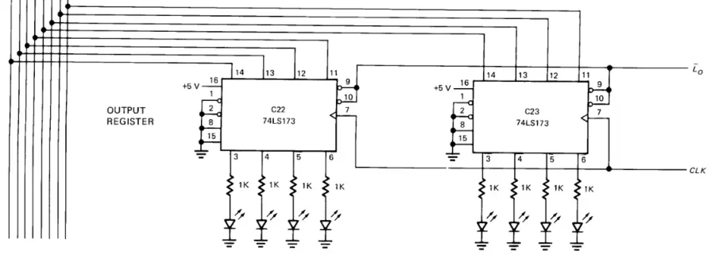

# Simple-As-Possible 컴퓨터

알버트 말비노(Albert P. Malvino)가 [[digital-computer-electronics]]에서 제시한 컴퓨터 모델. 단순한 SAP 컴퓨터 아키텍처를 통해 컴퓨터의 원리를 설명한다. 이 모델은 [벤 이터(Ben Eater)의 8비트 컴퓨터 프로젝트](https://eater.net/8bit)에도 영향을 줬다.

## SAP-1

### Architecture

#### Program counter

0000부터 1111까지 증가하는 카운터. 인스트럭션을 하나 fetch하면 카운트가 하나 늘어난다. 따라서 각 fetch 사이클의 시작점에서 PC는 현재 인스트럭션의 주소를 가지고 있게 된다.

#### Input & MAR (Memory address register)

입력 유닛에는 주소 스위치 레지스터와 데이터 스위치 레지스터가 포함된다. 주소 스위치 레지스터는 PC로부터 주소를 받아서 메모리에 전달하는 역할을 하고, 데이터 스위치 레지스터는 입력 데이터를 저장한다. 두 스위치 레지스터는 4개의 주소 비트와 8개의 데이터 비트를 RAM으로 전달할 수 있다. 참고로 인스트럭션과 데이터 워드는 컴퓨터 구동 전에 RAM에 작성되어 있어야 한다. 다이어그램에서 핀 14, 11, 5, 2는 주소 스위치 레지스터로부터 들어온다.

MAR은 메모리의 일부로, 컴퓨터가 작동할 때 PC의 주소 값을 전달받는다. 이후 MAR은 읽기 동작이 수행될 때 전달받은 4비트 주소를 RAM에 전달한다.

#### Random-access memory

16 $\times$ 8 정적 TTL RAM. RAM은 MAR로부터 4비트 주소를 받는다. 이 주소를 이용해 RAM에 저장된 인스트럭션 워드나 데이터 워드를 W 버스로 연결된 컴퓨터의 다른 부분에서 사용할 수 있다.

#### Instruction register

메모리로부터 인스트럭션을 읽기 위해 컴퓨터는 메모리 읽기 동작을 수행하는데, 이때 IR은 W 버스에 주어진 메모리 주소의 내용을 전달한다. IR의 내용은 두 니블(4비트)로 나뉘는데, 상위 니블은 Controller-sequencer 블록으로 직접 전달되며, 하위 니블은 W 버스로 전달된다.

#### Controller-sequencer

각 컴포넌트에 적절한 신호를 보내 제어하는 역할을 한다. IR로부터 받은 opcode를 보고 이에 따라 $CON = C_PE_PL_ME_R\ L_IE_IL_AE_A\ S_UE_UL_UL_U$ 신호를 출력한다. 계산기와 컴퓨터를 구분짓는 결정적인 요소이다.

#### Accumulator (A)

연산의 중간 결과를 저장하는 버퍼 레지스터다. 두 출력 중 하나는 Adder-subtracter로 직접 전달되고, 다른 하나는 W 버스로 전달된다. 8비트 accumulator 워드는 연속적으로 adder-subtractorer로 흘러가며, $E_A$가 HIGH일 때 같은 워드가 W 버스로 전달된다.

#### Adder-subtracter

2의 보수를 사용하는 adder-subtracter이다. $S_U$가 LOW일 때 출력은 $S = A + B$이며, HIGH일 때 출력은 $A = A + B'$이다. adder-subtracter는 비동기적(unclocked)이며, 입력 워드가 바뀌면 최대한 빠르게 내용이 변경된다. $E_U$가 HIGH일 때 결과가 W 버스로 전달된다.

#### B register

산술 연산에 사용하는 버퍼 레지스터.

#### Output register

컴퓨터가 연산을 마치면 accumulator에 결과가 저장되는데, 이 결과를 외부 세계에 표현하기 위한 레지스터이다.

#### Binary display

단순히 8개의 LED로 구성된 디스플레이. output register의 결과를 바이너리 형식으로 보여준다.

### Machine cycle

컨트롤 유닛은 컴퓨터의 자동화된 연산의 핵심이다. 프로그램과 데이터가 메모리에 로드된 뒤, 시작 신호는 제어권을 CON에게 넘긴다. CON은 각 인스트럭션을 fetch, execute하는 컨트롤 워드를 출력한다. 각 인스트럭션이 fetch, execute되는 동안, 컴퓨터는 레지스터 내용이 변경되는 6단계의 machine cycle를 거친다. 사이클의 페이즈를 나타내기 위해서는 링 카운터를 사용한다.

링 카운터는 CON의 일부다. 링 카운터는 $T = T_5T_4T_3T_2T_1T_0$ 출력을 내며, 컴퓨터가 막 실행됐을 때 링 워드는 $T = 000001$가 된다. 다음 네거티브 클럭 엣지마다 링 워드는 $T = 000010$, $T = 000100$, $T = 001000$, ..., $T = 100000$과 같이 증가한다. 링 카운터는 다시 $T = 000001$로 돌아오며, 이 사이클을 반복한다. 각 링 워드는 하나의 머신 페이즈를 의미한다.

- Fetch cycle:
  - $T_0$는 주소 페이즈(address phase)로, 이때 PC의 주소가 MAR로 전달된다. CON은 주소 페이즈를 위해 $0110\ 0000\ 0000$을 출력한다.
  - $T_1$은 메모리 페이즈다. MAR로부터 주소를 받은 ROM은 해당하는 인스트럭션을 IR로 보낸다. 이때 CON의 출력은 $0001\ 1000\ 0000$.
  - $T_2$는 증가 페이즈(increment phase)다. PC가 1 증가하며, fetch 사이클의 마지막 단계다.
- Execution cycle: $T_3$부터 $T_5$는 execution 사이클이다. 인스트럭션에 따라 레지스터가 변경된다.
  - LDA 루틴: 만약 `LDA 9` 명령이 로드되면, $IR = 0000\ 1001$이 된다. 첫 실행 페이즈에서 IR은 4개의 MSB `0000`을 CON으로 보내고, 4개의 LSB `1001`은 버스를 통해 MAR로 로드된다. 두 번째 실행 페이즈에서는 MAR이 가리키는 ROM의 데이터가 A로 로드된다. 마지막 페이즈에는 CON이 모든 비트를 0으로 출력해 모든 레지스터가 비활성화된다.
  - ADD 루틴: `ADD B` 명령이 로드되면, $IR = 0001\ 1011$이 된다. 첫 실행 페이즈에서 opcode는 CON으로, 주소는 MAR로 보내진다. 두 번째 페이즈에서는 $E_R$과 $L_B$가 활성화되고, (CON에 인스트럭션에 따라 어떤 컨트롤 비트를 활성화할지 하드코드되어 있다.) ROM의 데이터는 B 레지스터로 전달된다. 마지막 페이즈에는 ALU가 A 레지스터에 B 레지스터의 값을 더하고, 그 결과를 A 레지스터에 저장한다.
