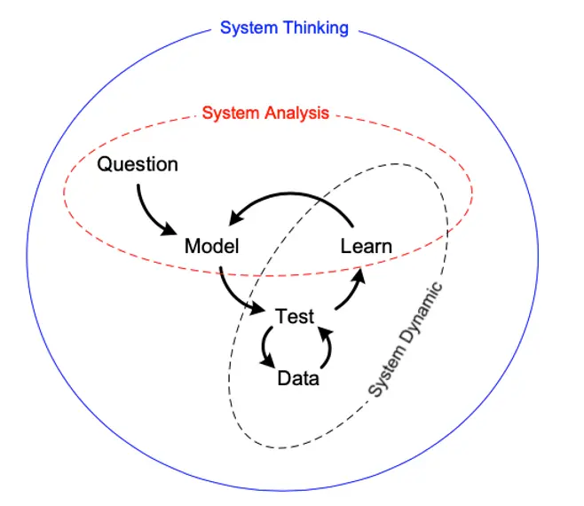
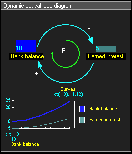

# 시스템 이론

_시스템 사고와 인과 루프 다이어그램. (c) Hordur V. Harardsson_

시스템 이론은 시스템(상호 연관된 구성 요소들의 집합)에 대한 연구 분야다. 산업혁명 이후 서구 사회는 복잡한 사물을 하위 단계로 세분화하는 환원주의적 접근을 통해 대상을 이해했다. 시스템 이론은 이러한 방식에서 벗어나 전체를 구성하는 요소 간의 상호작용에 초점을 맞춘다.

## 시스템 사고

시스템 이론의 관점으로 현실 세계의 복잡성을 이해하는 사고 방법이다. 이 사고법에 시스템 역학을 활용할 수 있다.

- 정치 지도자가 경기 호황과 불활을 초래하는 것이 아니다. 경기가 좋아지고 나빠지는 것은 시장 경제 구조의 영향을 받기 때문이다.
- 유가 상승 원인은 석유 수출국만의 책임만이 아니다. 석유 공급이 중단되면 경제가 취약해지도록 정책을 설계한 수입국의 책임이 있다.
- 바이러스가 인간을 공격하는 것이 아니다. 인간이 바이러스가 퍼지기 쉬운 환경을 조성한다.
- 약물 중독은 개인의 의지 부족 때문이 아니다. 약물 중독은 더 큰 일련의 사회 문제로 인해 발생한다.

모든 시스템의 기초는 저량(stock)이다. 저량은 유량(flow)의 작용을 통해 시간이 지남에 따라 변화한다. 예를 들어 욕조 시스템은 유입 유량과 욕조에 저장된 물의 양(저량), 유출 유량으로 구성된다. 사람의 마음은 유량보다 저량에, 유출 유량보다 유입 유량에 집중하는 경향이 있다.

## 시스템 역학

시스템 역학(System dynamics)은 시간에 따라 비선형적으로 변화하는 복잡한 시스템을 해석하기 위한 모델링 기법으로, 시스템 이론의 한 측면이다. 시스템 역학에서 시스템은 인과 루프 다이어그램(causal loop diagram)으로 표현한다.

다이어그램에서 화살표는 인과 관계를 나타낸다. 양의 인과 관계는 두 변수가 같은 방향으로 변화함을 의미한다. 연결의 시작점에 있는 저량이 감소하면 연결의 끝점에 있는 저량도 감소한다. 음의 인과 관계는 두 변수가 반대 방향으로 변화함을 의미한다. 연결의 시작점에 있는 저량이 감소하면 연결의 끝점에 있는 저량은 증가한다.

_양의 인과 관계와 음의 인과 관계 루프. (c) Patrhoue, CC BY-SA 3.0_

피드백 루프는 저량의 변화가 그 저량의 유입 유량이나 유출 유량에 영향을 미칠 때 형성된다. 가령 보통예금은 예금 잔고(저량)이 많아질수록 이자 수입(유입 유량)이 많아지고, 이자 수입이 많아질수록 예금 잔고가 더 많아지는 피드백 루프를 형성한다.

_보통예금의 강화 피드백 루프. (c) Patrhoue, CC BY-SA 3.0_

보통예금 시스템은 저량이 증가할수록 유입 유량이 증한다. (한편 저량이 적을수록 유입 유량이 감소하기도 한다.) 이러한 피드백 루프를 강화 피드백 루프(reinforcing feedback loop)라고 한다. 다이어그램에서는 화살표에 'R'로 표시한다.

어떤 피드백 루프는 저량을 정해진 임계치나 일정한 범위로 유지하려 한다. 예를 들어 컵에 담긴 커피 온도 시스템은 커피의 온도(저량)를 일정하게 유지하려는 피드백 루프를 형성한다. 뜨거운 커피의 온도는 실내 온도에 맞춰 내려가며, 커피가 식는 속도는 커피의 온도와 실내 온도의 차이에 비례한다. 반대로 더운 날 컵에 차가운 커피를 담아두면 실내 온도와 같아질 때까지 커피 온도가 올라간다. 이 시스템의 기능은 커피 온도와 실내 온도의 차이를 줄이는 것이다. 이러한 피드백 루프를 균형 피드백 루프(balancing feedback loop)라고 한다. 다이어그램에서는 화살표에 'B'로 표시한다.

## 관련문서

- [[thinking-in-systems]]
