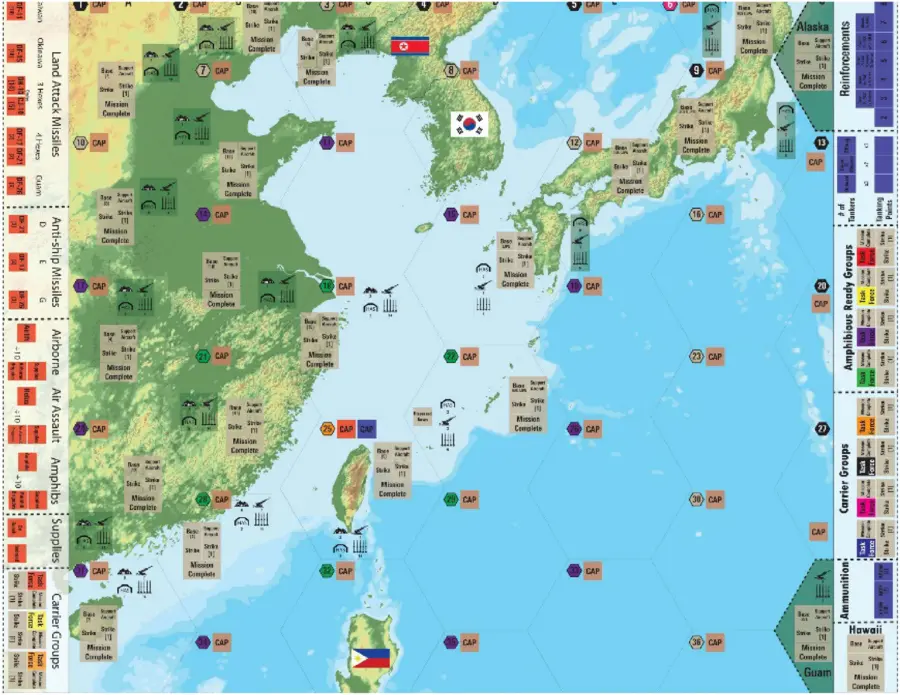
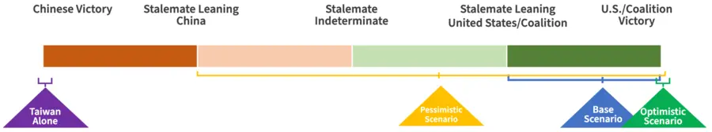

# The First Battle of the Next War

::: INFO
[Mark F. Cancian, et al., "The First Battle of the Next War: Wargaming a Chinese Invasion of Taiwan", CSIS, 2023](https://www.csis.org/analysis/first-battle-next-war-wargaming-chinese-invasion-taiwan)
:::

미국 국제전략문제연구소(CSIS)가 2023년 발간한 보고서. 2026년 중국의 대만 침공 시나리오를 24회에 걸쳐 워게임으로 분석한 결과를 담고 있다. 이 보고서의 목표는 (1) 중국의 침공 성공 가능성 평가, (2) 방어 성공의 핵심 변수 규명, (3) 미국, 대만, 일본의 정책적 대응 방안 제시이다.

## Building the Taiwan Operational Wargame

대만 작접 워게임(TOW)은 서태평양 작전 지도 위에서 진행된다. 지도상 타일의 크기는 좌우 약 600km이며, 각 타일에는 주기할 수 있는 비행대대 수와 격납고에 수용할 수 있는 비행대대의 수, SAM 대대의 수와 같은 정보를 표시한다. 게임의 한 주기는 3.5이다.

_(c) CSIS_

중국 인민해방군 로켓군은 강력한 전력이다. 게임 주기는 지상 미사일의 공격으로 시작되며, 주로 미국과 일본의 수상함과 공군 기지를 타격한다. 플레이어는 병력에 명령을 내릴 수 있다. 또한 특정 항구의 전력을 차단해 상륙 수송 능력을 저하시키는 전술 수준의 사이버 작전이 가능하다.

## Assumptions - Base Cases and Excursion Cases

워게임은 정치적, 전략적, 전술적 수준의 변수를 계층적으로 설계했다. 기본 케이스는 주어진 변수의 가장 가능성 높은 케이스다. 예외 케이스는 확률은 낮지만, 가능성이 있는 케이스다.

### Grand Strategic

| 가정 | 기본 케이스 | 예외 케이스 |
| ---- | ----------- | ----------- |
| **중국** | | |
| 중국의 침공, D-Day 결정 | | |
| **대만** | | |
| 대만의 저항 | 강한 저항 | |
| **미국** | | |
| 미국의 참전 | 자동 참전 | 대만의 고립 폭격기의 D+4 지연 D+14 참전 |
| 대만 주둔 미군 | 없음 | MLR 사전 전개 |
| **일본** | | |
| 일본 기지권 | 허용 | 중립 |
| 자위대 참전 | 공격 대응 | D-Day 참전 |
| 자위대 작전 | 참전 후 모두 허용 | 방어적 작전 |
| **기타** | | |
| 필리핀 | 미개입 | 기지 사용 허용 |
| 그 외 동맹 | 호주 | |
| 그 외 침공국 | 없음 | 미국이 동시 위기로 혼란 |

- 인도, 싱가폴, 태국, 베트남은 중국의 팽창을 우려하지만, 동시에 중국의 군사력을 두려워한다. 이들은 미국과 대만의 입장에 공감하겠지만, 중국의 직접적인 공격 위험에 노출되는 것을 원치 않는다. 따라서 이들은 소극적 접근을 취할 것이며, 미국의 상공 통과나 통항은 허용하되, 자국 영토에서의 군사 작전 수행이나 직접 참전은 허용하지 않을 것이다.
- 한국은 중국의 군사력뿐 아니라 북한의 적대적 행동에서 깊은 우려를 갖는다. 윤석열 대톨영은 "대만해협에서 전쟁이 일어나면 북한이 도발할 가능성이 높다"고 밝힌 바 있다. 이에 따라 이 워게임에서는 다음과 같이 가정한다.
  - 중국과의 전면 충돌이 워낙 중대한 사안이기 때문에 미국은 주한미군 전투비행대대 4개 중 2개를 대만 방어에 투입할 수 있다.
  - 북한의 지속적인 위협 때문에 나머지 2개 대대는 한국에 잔류하여 억제 임무를 유지한다.
- 호주는 미국과의 긴밀한 동맹 관계에 있고, 평시 주둔 미군이 있으므로 미국에 기지권과 주둔, 상공통과를 제공할 것이다. 호주군은 남중국해 전투에 직접 참전하겠지만, 이로 인해 대만 작전에는 관여하지 못할 것이다.
- 필리핀은 기본 케이스에서 중립을 유지한다. 필리핀군의 전력 수준이 중국군에 비해 압도적으로 약하고, 필리핀의 공군은 주로 대내 반군작전에 초점이 맞춰져 있기 때문이다. 이러한 군사력의 불균혁은 서필리핀해 사건에서 명확히 드러났다. 두테르테 대통령은 "그곳(남중국해)에서 나는 아무런 힘이 없다"고 발언한 바 있다.

### Strategic

| 가정 | 기본 케이스 | 예외 케이스 |
| ---- | ----------- | ----------- |
| **전투 순서** | | |
| 중국 | 기본 | 중거리탄도미사일 증가 전술탄도미사일 보유 |
| 대만 | 기본 | 적은 하푼미사일 |
| 미국 | 기본 | 잠수함 지연 |
| 일본 | 기본 | |
| **동원** | | |
| 중국 | D-30 | |
| 미국 | D-14 | D-Day 동원 무력 시위 미실시 |
| 대만 대응 | 즉시 | D+4까지 무력화 |
| **교전규칙** |
| 미국/일본 영토에 대한 중국의 공습 | 승인 | |
| 미국의 중국 본토 공습 | 승인 | 금지 |

### Operational and Tactical

| 가정 | 기본 케이스 | 예외 케이스 |
| ---- | ----------- | ----------- |
| **역량** | | |
| 중국 상륙군 | 2차 세계대전 미국과 동등 | 역량 저하 |
| 대만 지상군 | 중국과 동등 | 역량 저하 |
| 중국 공군 | 미국과 동등 | 공대공 역량 저하 |
| **무기** | | |
| JASSM 해상 타격 | 사용 | 미사용 |
| 함정 방어 | 작동 | 미흡 |
| 대우주 및 사이버 | 다소 효과적 | |
| 5세대 항공기 | 미국과 중국 동등 | 미국 우위 |
| **인프라** | | |
| 일본 강화격납고 | 프로그램대로 | 증가 |
| 일본 민간공항 동원 | 부대당 1개 지역 공항만 사용 | 대형 공항 동원 |

## Results

_(c) CSIS_

기본 케이스에 대해서는 3회 반복을 수행했다. 3번 중 2번은 상륙한 중국군이 대만의 주요 도시를 점령하지 못했고, 10일 내에 보급품이 고갈되었다. 나머지 한 번에서 중국군이 타이난 항구를 점령했으나, 미국의 공습으로 인해 항구가 파괴되었고, D+21까지 중국이 불리한 교착상태에 머물렀다. 모든 경우에 중국 상륙함대의 90%가 파괴되어 상륙군의 보급은 공중 투하에만 의존했다. 중국이 작전 목표를 달성하지 못했지만, 참전한 모든 국가도 큰 손실을 입었다. 

19번의 비관적 시나리오에는 JASSM 해상 타격 미사용 조건이 포함되어 있었다. 비관적 시나리오에서 중국은 평균 60개 대대를 대만에 상륙시켰고, 대만 영토의 17%를 장악했다. 시나리오에 비관적인 가정이 많을수록 미국과 대만에게 불리한 결과가 나왔다. JASSM 해상 타격 미사용이라는 단 하나의 비관적 가정을 적용해 실행된 세 번의 게임은 중국의 결정적인 패배 1건과 중국에게 불리한 교착 상태 2건으로 종결되었다.

2번의 낙관적 시나리오에는 미군에 대한 일본의 인프라 접근 허용, 중국의 미사일 역량 저하 등의 예외 케이스를 적용했다. 두 낙관적 시나리오는 모두 중국의 결정적인 패배로 종결되었다. 하지만 미국과 대만도 많은 피해를 입었다. 낙관적 시나리오에서는 주로 장거리 미사일이 사용되어 공대공 전투가 거의 없었다. 이로 인해 미국의 항공기 우위 조건은 영향을 거의 미치지 못했다.

대만 고립 시나리오는 대만이 미국의 물질적 지원없이 생존할 수 있는지 평가하기 위해 설계되었다. 이 시나리오는 2개월 후 대만이 탄약 부족으로 발사 빈도를 전반으로 줄이고, 3개월 후에는 탄약 고갈로 포병 부대를 보병 부대로 재편하는 것으로 가정했다. 또한 중국은 미국과 일본의 개입을 저지하기 위해 일부 항공기를 작전에 투입하지 않는다. 대만 고립 시나리오에서 중국군은 대만 남부에 상륙하여 3주 후 타이난과 가오슝을 점령했다. 6주 후에는 타이중을 점령했고, 기갑부대가 10주 만에 타이베이의 총통 청사를 점령했다. 중국 지상군은 70,000명, 대만 지상군은 85,000명의 사상자를 냈다.

라그나로크 시나리오는 대만의 저항과 미국의 개입에도 불구하고 중국이 승리할 수 있는 조건을 평가하기 위해 설계되었다. 이 시나리오에서 중국은 미국의 공군력을 무력화하고, 일본은 중립을 유지해야 승리할 수 있었다. 중국군은 주일미군을 신경쓰지 않고 괌에 미사일 공격을 집중했다. 미국 함대는 대만을 방어하지 못하고 대부분 파괴되었다.

## 참고자료

- [전창빈, "다음 전쟁의 첫 번째 전투", 한국해양전략연구소, 2023](https://kims.or.kr/publication/issue-focus/if-230718/)
