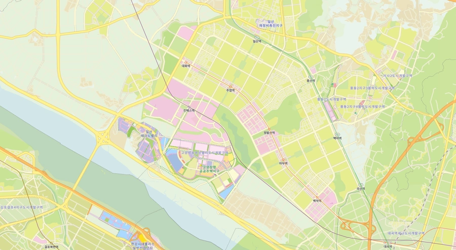

# 용도지역

용도지역(用途地域)은 토지의 이용과 건축물의 용도, 건폐율, 용적률, 높이 등을 규제함으로써 토지를 경제적, 효율적으로 이용하고, 공공복리를 증진하기 위해 서로 중복되지 않게 설정하는 지역을 의미한다.

## 상세

| 용도지역 | 목적 |
|---|---|
| 도시지역 | 인구와 산업이 밀집되어 있거나 밀집이 예상되어 그 지역에 대하여 체계적인 개발·정비·관리·보전 등이 필요한 지역 |
| 관리지역 | 도시지역의 인구와 산업을 수용하기 위하여 도시지역에 준하여 체계적으로 관리하거나 농림업의 진흥, 자연환경 또는 산림의 보전을 위하여 농림지역 또는 자연환경보전지역에 준하여 관리할 필요가 있는 지역 |
| 농립지역 | 도시지역에 속하지 아니하는 농지법에 따른 농업진흥지역 또는 산지관리법에 따른 보전산지 등으로서 농림업을 진흥시키고 산림을 보전하기 위하여 필요한 지역 |
| 자연환경보전지역 | 자연환경·수자원·해안·생태계·상수원 및 문화재의 보전과 수산자원의 보호·육성 등을 위하여 필요한 지역 |

### 도시지역

| 도시지역 | 목적 |
|----|----|
| 주거지역 | 거주의 안녕과 건전한 생활환경의 보호를 위하여 필요한 지역 |
| 상업지역 | 상업이나 그 밖의 업무의 편익을 증진하기 위하여 필요한 지역 |
| 공업지역 | 공업의 편익을 증진하기 위하여 필요한 지역 |
| 녹지지역 | 자연환경·농지 및 산림의 보호, 보건위생, 보안과 도시의 무질서한 확산을 방지하기 위하여 녹지의 보전이 필요한 지역 |

#### 주거지역

주거지역은 크게 전용주거지역과 일반주거지역, 준주거지역으로 구분된다.

- 전용주거지역: "양호한 주거환경을 보호하기 위하여 필요한 지역"으로, 기존에 형성된 양호환 주거환경을 보전할 필요가 있는 지역이나 자연녹지지역이 연계되어 있는 지역에 지정한다.
- 일반주거지역: "편리한 주거환경을 조성하기 위하여 필요한 지역"으로, 주거 기능을 기본으로 하되, 일정 수준의 편의시설을 수용하여 인근의 주거 및 근린생활시설과 조화를 이룰 필요가 있는 지역에 지정한다.
- 준주거지역: "주거기능을 위주로 이를 지원하는 일부 상업기능 및 업무기능을 보완하기 위하여 필요한 지역"으로, 주거용도와 상업용도가 혼재하지만, 주로 주거환경을 보호하기 위한 지역에 지정한다.

| 주거지역 | 목적 |
|----|----|
| 제1종전용주거지역 | 단독주택 중심의 양호한 주거환경을 보호하기 위하여 필요한 지역 |
| 제2종전용주거지역 | 공동주택 중심의 양호한 주거환경을 보호하기 위하여 필요한 지역 |
| 제1종일반주거지역 | 저층주택을 중심으로 편리한 주거환경을 조성하기 위하여 필요한 지역 |
| 제2종일반주거지역 | 중층주택을 중심으로 편리한 주거환경을 조성하기 위하여 필요한 지역 |
| 제3종일반주거지역 | 중고층주택을 중심으로 편리한 주거환경을 조성하기 위하여 필요한 지역 |
| 준주거지역 | 주거기능을 위주로 이를 지원하는 일부 상업기능 및 업무기능을 보완하기 위하여 필요한 지역 |

#### 상업지역

| 상업지역 | 목적 |
|----|----|
| 중심상업지역 | 도심ㆍ부도심의 상업기능 및 업무기능의 확충을 위하여 필요한 지역 |
| 일반상업지역 | 일반적인 상업기능 및 업무기능을 담당하게 하기 위하여 필요한 지역 |
| 근린상업지역 | 근린지역에서의 일용품 및 서비스의 공급을 위하여 필요한 지역 |
| 유통상업지역 | 도시내 및 지역간 유통기능의 증진을 위하여 필요한 지역 |

### 관리지역

| 관리지역 | 목적 |
|----|----|
| 보전관리지역 | 자연환경 보호, 산림 보호, 수질오염 방지, 녹지공간 확보 및 생태계 보전 등을 위하여 보전이 필요하나, 주변 용도지역과의 관계 등을 고려할 때 자연환경보전지역으로 지정하여 관리하기가 곤란한 지역 |
| 생산관리지역 | 농업·임업·어업 생산 등을 위하여 관리가 필요하나, 주변 용도지역과의 관계 등을 고려할 때 농림지역으로 지정하여 관리하기가 곤란한 지역 |
| 계획관리지역 | 도시지역으로의 편입이 예상되는 지역이나 자연환경을 고려하여 제한적인 이용·개발을 하려는 지역으로서 계획적·체계적인 관리가 필요한 지역 |

## 한계와 대안

용도지역이 배타적으로 구분되고, 단일 용도 구획이 커질 때 문제가 생긴다. 서울시의 도시 밀도는 전세계적 기준에서 높지 않은 편이다. 서울의 평균 용적률은 145%, 평균 건폐율은 50%로, 서울 건축물의 평균 층수는 2.9층에 불과하다. 고층 아파트가 고밀도 도시의 상징처럼 여겨지기도 하지만, 일반적으로 한국 아파트 단지는 건폐율이 낮아 밀도가 높지 않다. 아파트가 높아질수록 건물간 간격은 멀어진다. 빌라와 같은 저층 다세대주택은 건물간 간격을 좁힘으로써 밀도를 구현하기 때문에 아파트보다 밀도가 낮다고 할 수 없다. 실제로 아파트의 평균 건폐율을 30% 미만이고, 주택가는 60%를 가득 채우곤 한다.

그러나 실제 서울에 거주하는 사람들은 서울의 밀도가 과도하게 높다고 감각한다. 이는 주거지역과 상업지역이 배타적으로 구분되어 있어 도시의 기능 단절을 초래하기 때문이다.

_서울특별시 종로구, 중구_

강북은 종로구와 중구 도심에 상업지역이 밀집해 있고, 그 주변을 주거지역이 둘러싸고 있다. 서울 도심과 부도심, 그리고 경기도의 인구가 출근 시간대에는 도심의 상업지역으로 쏟아져 들어오고, 퇴근 시간대에는 밀려 나가며 과도한 혼잡을 유발한다. 

서울에만 국한되는 문제가 아니다. 쾌적한 주거지역과 번화한 상업지역의 구분으로 전원생활을 이룩할 수 있다는 환상이 깔린 1기 신도시는 문제가 더욱 심하다. 수익성이 중요한 택지개발 사업에서는 도심에 상업지역을 배치하고, 부도심에 주거지역을 배치하도록 계획한다. 성남시 분당구, 고양시 일산서구, 동구는 지하철역 주변과 대로 주변에 상업지역이 밀집해 있고, 한쪽에 주거지역이 밀집되어 있다. 도시 기능이 단절되어 용도지역을 건너뛰어야 한다는 것은 곧 이동 비용의 증가를 의미한다. 작은 요리 재료 하나를 사기 위해서 상업지역에 있는 마트로 이동해야 하고, 결국 자동차가 없으면 이동이 어려워진다. 한국에서 배달 산업이 발달한 데에는 이러한 도시 구조도 원인으로 작용한다.

_경기도 성남시 분당구_

_경기도 고양시 일산서구, 일산동구_

단일 용도 택지가 커질수록 도시 기능은 더욱 단절된다. 특히 거대한 아파트 단지가 문제가 되는데, 기존에는 누구나 걸어서 통과할 수 있었던 지역이 폐쇄적인 아파트 단지가 들어서며 이동이 불가능해지곤 한다. 도시 기능이 단절되어 있다보니 신축 아파트 단지 안에는 각종 커뮤니티 시설이 들어선다. 이로 인해 아파트 단지가 요새화되고, 도시의 연결성이 저해된다. 그리고 이와 같은 폐쇄성으로 인해 이동은 더욱 어려워지는 악순환이 발생한다.

대안 중 하나는 복합용도다. 복합용도는 주거와 상업이 혼합된 형태로, 도시 기능을 단절시키지 않으면서 도시에 활력을 불어넣을 수 있는 방법이다. 세운상가가 좋은 예시다.

_잡지 <여원>에 실린 세운상가 홍보 전단_

## 관련문서

- [[gyeonggi-do-citizens-sense-of-urban-area]]

## 참고자료

- [EBS, "다큐프라임: 도시예찬 1부 서울은 정말 과밀할까?", 2021](https://www.youtube.com/watch?v=sqlTKlNvvX4)
